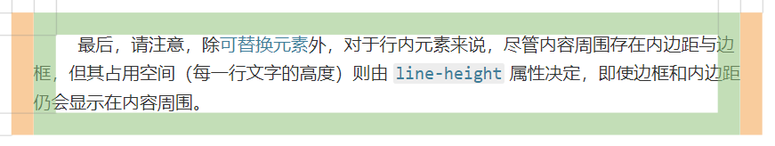
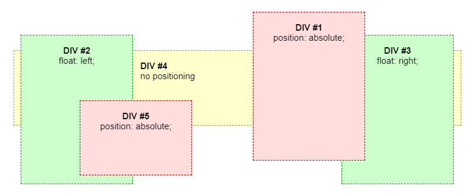
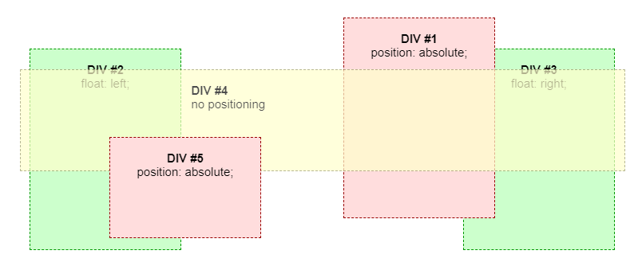

- [为什么要有 CSS 私有前缀？](#为什么要有-css-私有前缀)
- [常用浏览器的对应内核？](#常用浏览器的对应内核)
- [CSS 中以 @ 开头的有哪些？](#css-中以--开头的有哪些)
  - [CSS 盒模型](#css-盒模型)
  - [什么是 BFC？规则是什么？如何创建？](#什么是-bfc规则是什么如何创建)
  - [行内元素和块级元素的区别](#行内元素和块级元素的区别)
- [手写 CSS 清除浮动](#手写-css-清除浮动)
  - [CSS 选择器权重](#css-选择器权重)
  - [CSS 中的 position 有哪些属性？](#css-中的-position-有哪些属性)
  - [CSS 层叠上下文](#css-层叠上下文)
  - [CSS 合成层](#css-合成层)
  - [IE 不兼容的 CSS3 属性，及解决办法？](#ie-不兼容的-css3-属性及解决办法)
  - [Bootstrap 分界点](#bootstrap-分界点)

## 为什么要有 CSS 私有前缀？

一些标准，在 W3C 还没有正式宣布支持时，可能会发生改变，所以浏览器如果想在标准定下来之前将其实现，那么必须满足：如果以后标准改变了，现有的实现不能改变（因为用户已经用你的 API 写好了代码，不能因为标准变了就让用户改代码）。所以，浏览器只能在标准定下来之前，使用私有前缀来将其实现。这样，标准定下来后，用户爱用哪个用哪个，带不带前缀由用户决定。

## 常用浏览器的对应内核？

> 参考资料：https://juejin.im/entry/57ff3cea0e3dd90057e5f25e

浏览器内核又可以分成两部分：**渲染引擎**和 **JavaScript 引擎**。

常见的浏览器内核有：

- Webkit（Safari，旧版 Chrome）
- Gecko（Firefox）
- Trident（IE 4~11）
- Presto（旧版 Opera）
- Blink（Chrome 28+，新版 Opera，新版 Edge）

EdgeHTML 渲染引擎是 Trident 内核的一个分支，用于老版 Edge。

Blink 渲染引擎是 Chromium 内核的一个分支，Chrome 28+，新版 Opera，新版 Edge。

**浏览器内核主要指的是浏览器的渲染引擎。** 例如，Webkit 内核，其渲染引擎是 WebCore，JavaScript 引擎是 JSCore。因此我们通常用 Webkit 代指渲染引擎（WebCore）。

Chromium 内核早期是以 Webkit（WebCore） 作为渲染引擎，JSCore 作为 JS 引擎。但是后来在 Webkit 的基础上，独立研发了 Blink 渲染引擎，并且独立研发了 V8 引擎代替 JSCore。因此关于 Chromium 内核如下：

- 早期 Chromium == Webkit（WebCore）+ JSCore
- 最新 Chromium == Blink + V8

国内很多的双核浏览器的其中一核便是 Trident，美其名曰 “兼容模式”。目前国内大多数浏览器都投入了 Blink 的怀抱。

移动端常用的浏览器内核有 Webkit，Blink，Gecko，Trident。其中 iOS 平台主要是 Webkit，Android 4.4 之前的系统浏览器内核是 WebKit，Android4.4 系统浏览器内核切换到了 Chromium（Blink + V8），Windows Phone 8 系统浏览器内核是 Trident。

## CSS 中以 @ 开头的有哪些？

- `@media` 媒体查询
- `@keyframes` 动画帧（IE10+）
- `@font-face` 自定义字体

  > WOFF 字体 IE9+
  > WOFF 2.0 字体 Edge14+
  > TTF/OTF 字体 Edge12+；IE9~11 部分支持
  > SVG 字体（兼容性很差）
  > EOT 字体（只有 IE 支持）

- `@charset` 指定样式表的编码
- `@import` 从其他样式表导入样式规则
- `@page` 在打印文档时修改某些 CSS 属性（兼容性很差）
- `@apply` 用于应用混合（Mixins）（兼容性很差，无浏览器实现）

  ```css
  /* 定义 CSS 原生 Mixins */
  --clearfix: {
    display: table;
    clear: both;
    content: '';
  }

  /* 使用定义的 Mixins */
  div {
    @apply --clearfix;
  }
  ```

- `@supports` 用于检测 CSS 属性是否被支持（兼容性很差）
- `@viewport` 设置视口宽度（非标准）

### CSS 盒模型

- 分为 IE 盒模型、W3C 标准盒模型。

  - IE 盒模型

    `width、height = content`

  - W3C 盒模型

    `width、height = content + padding + border`

- 获取盒模型的尺寸

  ```js
  // 只能获取行内样式的宽、高
  elem.style.width / height;

  // 获取计算后的样式（宽、高）
  window.getComputedStyle(elem, null).width / height;

  // 获取渲染后的样式（宽、高）
  elem.getBoundingClientRect().width / height;
  ```

### 什么是 BFC？规则是什么？如何创建？

参考资料：[MDN: Block formatting context](https://developer.mozilla.org/en-US/docs/Web/Guide/CSS/Block_formatting_context)

- 什么是 BFC

  BFC（Block Formatting Context，块格式化上下文）是 Web 页面中可视的 CSS 渲染的一部分，它是块盒子布局时所在的区域，该区域中的浮动元素与其他元素相互作用（即清除浮动的作用）。

  > 我的理解：就是页面中的一个渲染区域，该区域是块级的，并且该区域中的浮动元素不影响其它 BFC 中元素的布局（所以该特性经常被用来清除浮动）。

- BFC 规则

  1、外边距合并只发生在同一个 BFC 中（阻止 `margin` 合并）。
  2、计算 BFC 高度的时候，浮动元素会参与计算（清除浮动）。
  3、BFC 是一个独立的容器，和外面的元素互不影响。

- BFC 创建

  以下方式会创建**块格式化上下文**：

  - `<html>`
  - `position: absolute/fixed`
  - `float` 不为 `none`
  - `overflow` 不为 `visible`
  - `display: flow-root`
  - `display: inline-block`
  - `display: table-cell`（HTML 表格单元格默认为该值）
  - `display: table-caption`（HTML 表格标题默认为该值）
  - `display` 为 `table`、`table-row`、`table-row-group`、`table-header-group`、`table-footer-group`（它们分别是 HTML 中 `<table>`、`<row>`、`<tbody>`、`<thead>`、`<tfoot>` 的默认属性）
  - `contain` 为 `layout`、`content`、`paint`
  - `display` 为 `flex`、`inline-flex` 的**直接子元素**
  - `display` 为 `grid`、`inline-grid` 的**直接子元素**
  - `column-count`、`column-width` 不为 `auto`
  - `column-span` 为 `all` 的元素始终会创建一个新的 BFC

### 行内元素和块级元素的区别

块级元素：

- 默认情况下，独占一行
- 宽、高、内边距、外边距都可控制
- 默认宽度 100%
- 设置 `border-bottom` 会在元素块下面显示一条线

行内元素：

- 和其他行内元素或文本显示在同一行
- 宽、高、内边距、外边距不可控制
- 默认宽度是内容的宽度
- 设置 `border-bottom` 会在每行文本下面显示一条线

> 行内元素的内边距、外边距只会影响文本的首行缩进，不会影响到宽高。如图所示：
>
> 

打个比方，行内元素就像是一个单词，块级元素就像是一个段落。

## 手写 CSS 清除浮动

> 不考虑 Hack IE

1. 编写 CSS 类 `.clearfix`

   ```css
   .clearfix::after {
     content: '';
     display: table;
     clear: both;
   }
   ```

   或：

   ```css
   .clearfix::after {
     content: '';
     visibility: hidden;
     display: block;
     height: 0;
     clear: both;
   }
   ```

2. 在浮动元素的父元素上使用 `overflow: hidden;`
3. 在浮动元素的父元素上使用 `display: inline-block;`
4. 在浮动元素后面添加一个 DOM 元素，并使用 `clear: both;`
5. 使用 `<br>` 元素，其自带清除浮动的属性 `<br clear="both">`

其中，最常用的是方法 1、2、3，如果方法 4 不建议使用，方法 5 坚决反对使用（违背了结构，样式，行为分离的准则）。

### CSS 选择器权重

`!important` > `内联` > `ID` > `类 | 伪类 | 属性` > `元素 | 伪元素` > `通配符` > `继承` > `浏览器默认`

> 网上流传的一种说法是，**权重大小：内联 1000，ID 100，类 10，元素 1**。这种说法只是为了帮助理解，并不代表 10 个元素选择器的权重就大于 1 个 类选择器的权重。

总之，选择器的权重大小顺序如上，但是权重具体是多少并不确定，会因浏览的的不同而有所差异。举个例子：在 Chrome 中，**可能** 20 个类选择器的权重会大于 1 个 ID 选择器的权重，但是在 Firefox 中就不一定是这样。

### CSS 中的 position 有哪些属性？

有五种定位方式：

- `static`
- `relative`
- `absolute`
- `fixed`
- `sticky`

1. 元素默认是 `static` 定位，会以正常的文档流进行布局

   元素设置为 `static` 后，`top`、`right`、`bottom`、`left` 和 `z-index` 属性无效。

2. `relative`、`absolute`、`fixed` 都会相对于某个定位基点来进行定位

   - `relative`

     1、**定位基点是默认位置**。

     2、在没有设置 `left`、`top`、`right`、`bottom` 的时候，元素位置和正常文档流中的位置一样。

     3、如果设置了 `left`、`top`、`right`、`bottom`，会在不改变页面布局的前提下调整元素位置（在元素原来的位置留下空白）。

   - `absolute`

     1、**定为基点是上级元素（一般是父元素）**。前提是父元素不能是 `static`，否则定位基点会变成 `html` 元素。

     2、元素会被移出正常文档流，也就是元素原来的位置会被其他元素占据。

     3、可以设置 外边距（`margin`），但是不会和其他元素的外边距合并（因此元素单独处在一个图层）。

   - `fixed`

     1、**定位基点是屏幕视口（viewport，浏览器窗口）**。

     2、元素会被移出正常文档流，也就是元素原来的位置会被其他元素占据。

     3、**会创建新的层叠上下文**。

     4、当元素的某个祖先的 `transform`、`perspective` 或 `filter` 属性非 `none` 时，定位基点由视口改为该祖先。

3. `sticky` 属性的效果类似于 `static` + `fixed`

   1、必须指定 `left`、`top`、`right` 或 `bottom` 其中之一，才能使该属性生效。否则元素仍会处于正常文档流中的位置。

   2、**该属性总会创建一个新的层叠上下文**。

   3、当元素的某个祖先具有 `overflow` 属性时，定位基点变为该祖先。

   **具体效果是**：当父元素完全在视口中时，效果和默认一样；当父元素部分脱离视口时，效果类似于 `fixed`，会相对视口定位；当父元素完全脱离视口时，效果和 `static` 一样，会还原成正常的文档流中的位置。

### CSS 层叠上下文

> 参考资料：
>
> - [MDN: The stacking context](https://developer.mozilla.org/en-US/docs/Web/CSS/CSS_Positioning/Understanding_z_index/The_stacking_context)
> - [深入理解 CSS 中的层叠上下文和层叠顺序](https://www.zhangxinxu.com/wordpress/2016/01/understand-css-stacking-context-order-z-index/)

- 形成条件

  文档中的层叠上下文由满足以下任意一个条件的元素形成：

  - 文档根元素（`<html>`）
  - `position: absolute/relative` 且 `z-index` 值不为 `auto` 的元素
  - `position: fixed/sticky`
  - `flex` 容器的子元素，且 `z-index` 值不为 `auto`
  - `grid` 容器的子元素，且 `z-index` 值不为 `auto`
  - `opacity` 属性值小于 1 的元素
  - `mix-blend-mode` 属性值不为 `normal` 的元素
  - 以下任意属性值不为 `none` 的元素：
    - `transform`
    - `filter`
    - `backdrop-filter`
    - `perspective`
    - `clip-path`
    - `mask / mask-image / mask-border`
  - `isolation` 属性值为 `isolate` 的元素
  - `will-change` 值设定了任一属性，在非初始值时，会创建层叠上下文
  - `contain` 属性值为 `layout、paint` 或包含它们其中之一的合成值（比如 `contain: strict`、`contain: content`）的元素

- 层叠与浮动

  **1、浮动元素的层叠顺序，会处于非定位元素和定位元素中间**。

  例如，有五个 `div` 元素，他们按编号在 DOM 中依次排列，最终效果如下：

  

  可以看到，浮动元素和定位元素都会覆盖在普通元素（没有浮动、定位）上，并且浮动元素处于它们两种元素之间。

  但是有一个很奇怪的效果：如果设置 `DIV #4` 的 `opacity`，那么该元素的背景和边框会显示在浮动元素和定位元素之上（**2、设置透明度会隐式的创建一个层叠上下文**）。效果如下：

  

- 层次结构

  1、所有元素的层叠上下文都属于根元素（`<html>`）的层叠上下文。

  2、当元素没有层叠上下文时，其层叠上下文同父元素。

  3、如果元素有层叠上下文，其效果不会大于父元素的。

  举例如下：

  - 根元素上下文
    - `DIV #2` (`z-index: 2`)
    - `DIV #3` (`z-index: 1`)
      - `DIV #4` (`z-index: 10`)

  虽然 `DIV #4` 的层叠上下文（`z-index: 10`）大于 `DIV #2` 的层叠上下文（`z-index: 2`），但是 `DIV #4` 在 `DIV #2` 下面，原因是 `DIV #4` 处于 `DIV #3` 所创建的层叠上下文中，而整个 `DIV #3`（包含其后代元素）是在 `DIV #2` 下面的。

### CSS 合成层

使元素提升至单独的合成层，有以下方法：

- **直接原因**

  - `iframe`、`video` 元素
  - `transform: translateZ(0)`
  - CSS 的 3D 属性或 CSS 的透视效果
  - `will-change`

    > 设置为 `opacity`、`transform`、`top`、`left`、`bottom`、`right`。其中使用 `top`、`left`、`bottom`、`right` 时，需要设置定位属性才能生效，如 `relative`。

  - CSS 动画中使用 `opacity`、`transform`、`fliter`

    > 动画过程中会提升到单独的合成层，动画未开始或结束时不会。

  - `...`

- **后代元素原因**

  - 有合成层后代，同时本身具有 `opacity`（小于 1）、`filter`、`mask` 属性
  - 有合成层后代，同时本身 `fixed` 定位。

- **隐式原因**

  如果一个元素**覆盖**了具有合成层的元素，那么该元素就会被提升到单独的合成层。

  > 如果不清楚这点，可能会写出导致 “合成层爆炸” 的代码。即整个页面的元素相互覆盖，所有元素都被提升到单独的合成层，使得资源耗尽，页面卡死。

- `...`

**性能优化的建议：**

- 将动画效果提升到单独的合成层中
- 使用 `transform` 或者 `opacity` 来实现动画

  > 当元素使用了这两个属性时，如果元素处于单独的合成层中，则动画只会触发页面渲染中的 Composite 阶段；如果元素没有处于单独的合成层，则动画会触发重绘（reprint）。

- 减少绘制区域

  > 仔细分析页面，将需要回流或重绘的区域，合理地提升至单独的合成层。

- 合成层需要消耗一定的资源，不要过分的使用
- 任何一种优化方法都不是完美的，需要带入具体环境具体分析。

### IE 不兼容的 CSS3 属性，及解决办法？

> 参考资料：[巧用浏览器 CSS 属性值的不兼容向下兼容 hack 技巧](https://www.zhangxinxu.com/wordpress/2016/10/browser-css-property-down-compatible-hack-technology/)

- `@font-face` IE9+ 支持引入任何格式的字体。

  解决办法：IE8 可以使用 EOT 格式的字体文件。

  

- `bos-shadow` IE9+

  解决办法：IE8- 使用 `border` 代替阴影。

- `border-radius` IE9+
- `background-size` IE9+
- `transform` IE9+
- `transition` IE10+
- `animation` IE10+

### Bootstrap 分界点

- `576px`：`xs`
- `768px`：`sm`
- `992px`：`md`
- `1200px`：`lg`

使用如下：

```css
/* Small devices (landscape phones, 576px and up) */
@media (min-width: 576px) {
}

/* Medium devices (tablets, 768px and up) */
@media (min-width: 768px) {
}

/* Large devices (desktops, 992px and up) */
@media (min-width: 992px) {
}

/* Extra large devices (large desktops, 1200px and up) */
@media (min-width: 1200px) {
}
```

或

```css
/* Extra small devices (portrait phones, less than 576px) */
@media (max-width: 575.98px) {
}

/* Small devices (landscape phones, 576px and up) */
@media (min-width: 576px) and (max-width: 767.98px) {
}

/* Medium devices (tablets, 768px and up) */
@media (min-width: 768px) and (max-width: 991.98px) {
}

/* Large devices (desktops, 992px and up) */
@media (min-width: 992px) and (max-width: 1199.98px) {
}

/* Extra large devices (large desktops, 1200px and up) */
@media (min-width: 1200px) {
}
```
