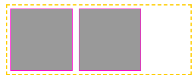
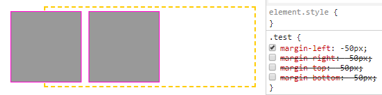
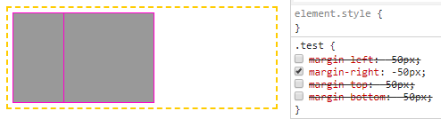
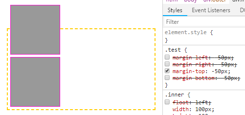
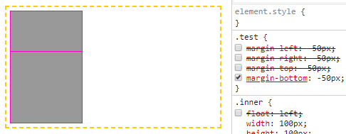
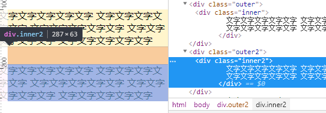
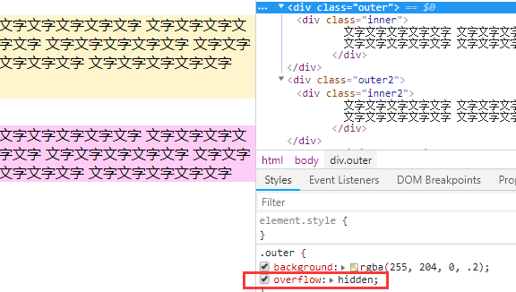
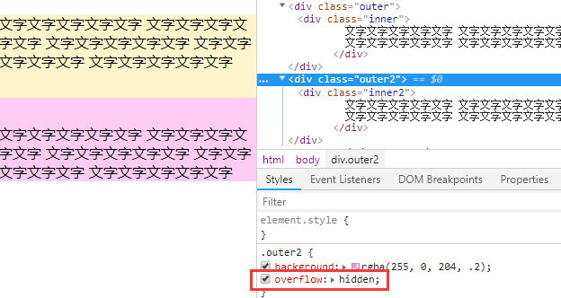

### `margin` 的左右负边距表现并不一致

  例如，有这样两个 `div`：

  

  第一个 `div` 添加属性：`margin-left: -50px`，效果如下：

  

  第一个 `div` 添加属性：`margin-right: -50px`，效果如下：

  

  第一个 `div` 添加属性：`margin-top: -50px`，效果如下：

  

  第一个 `div` 添加属性：`margin-bottom: -50px`，效果如下：

  

  可以看出，左边距为负时，表现为左移；右边距为负时，表现为左拉（自身不动，把右边的元素拉过来）。上下负边距与左右负边距同理。

### 通过触发 `BFC` 防止垂直方向 `margin` 合并

如下图，给两段文字分别加上 `margin-top` 和 `margin-bottom`，很显然，这两个属性的值会进行合并：

通过给外层容器添加属性 `overflow: hidden` 触发BFC，使得两者的 `margin` 各自进行计算，不会合并：

