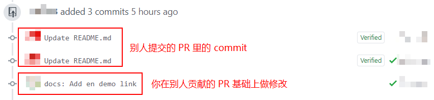

## Vim 操作

使用 Git 就避不开 Vim 的使用，一个最经典的的操作就是：如何保存并退出 Vim 编辑器。这个操作在 [Stack Overflow ](https://stackoverflow.com/questions/11828270/how-do-i-exit-the-vim-editor) 上的浏览量已经超过了 210 万次，可见其重要性。

下面是 Vim 的一些常用操作：

- `:q`（`:quit`）退出。

  如果内容更改了，则该操作无效。

- `:q!`（`:quit!`）强制退出。等价于 `ZQ`

  即使内容更改了，该操作也会生效，更改的内容丢失。

- `:wq` 保存并退出。

  无论内容是否更改，都会执行写操作。

- `:wq!` 强制保存，并退出。

  即使文件只有读权限，没有写权限，也要强制写入。

- `:x` 保存并退出。等价于 `:exit` 和 `ZZ`。

  仅当内容更改时，才执行写操作。

- `:qa`（`:quitall`）退出所有。

  如果内容更改了，则该操作无效。

- `:cq` 不保存并退出。

  会使 Vim 返回 non-zero 错误，效果是会强制退出。

执行 Vim 指令的步骤是：按下 `Esc` 键，然后输入 `:` + 操作指令（例如：`:wq`），最后按下 `Enter` 键。

刚进入 Vim 编辑器时，是无法直接修改内容的，需要按下 `Insert` 键，才可以进行编辑。按两次 `Insert` 键是进行替换操作。

## Git Bash

Git Bash 是 Git 的命令行工具，但它不等价于 Windows 中自带的 CMD 窗口。

Git Bash 中内置了一些 Linux 指令，例如：

- `cat` 指令，用于显示文件内容。

  - 语法：`cat 文件路径`

  - 使用示例：

    - `cat a.txt`
    - `cat dir1/a.txt`

- `ls` 指令，用于查看当前目录下的所有文件。

  默认不显示隐藏文件，常用的参数有：

  - `ls -sh` 显示文件大小。
  - `ls -ah` 显示隐藏文件。
  - `ls -sh -ah` 显示文件大小，并显示隐藏文件。

- `pwd` 指令，显示当前目录的绝对路径。
- `touch` 指令，新建一个文件。

  - 语法：`touch 文件名1 文件名2 ...`
  - 使用示例：

    - `touch a.txt`
    - `touch a.txt b.txt`

- `mkdir` 指令，新建文件夹。

  该指令是 `make directory` 的缩写。

  - 语法：`mkdir 文件夹名称1 文件夹名称2 ...`
  - 使用示例：

    - `mkdir dir`
    - `mkdir dir1 dir2`

- `rm` 删除一个文件

  - 语法：`rm 文件名1 文件名2 ...`
  - 使用示例：

    - `rm a.txt`
    - `rm a.txt b.txt`

  默认该指令无法删除文件夹，如果想删除文件夹，需要 `-r` 参数：`rm -r 文件夹名称`

- `mv` 移动文件

  - 语法：`mv 文件移动前的路径 文件移动后的路径`
  - 使用示例：`mv dir1/a.txt dir2/`

  > 必须保证路径中的目录都存在，否则会失败。

- `clear` 清屏

在 Git Bash 中，粘贴的快捷键不是 `Ctrl + v`，而是 `Shift + Insert`。

## NPM 修改源

```bash
# 修改 NPM 源地址为淘宝源
$ npm config set registry http://registry.npm.taobao.org/

# 修改 NPM 源地址为官方源
$ npm config set registry https://registry.npmjs.org/

# 通过指令参数指定源
$ npm install xxx --registry=https://registry.npm.taobao.org
```

## 常用指令

- 配置 log 指令输出样式和别名

  ```bash
  $ git config --global alias.lg "log --color --graph --pretty=format:'%Cred%h%Creset -%C(yellow)%d%Creset %s %Cgreen(%cr) %C(bold blue)<%an>%Creset' --abbrev-commit"
  ```

- 和远程仓库交互

  - 本地仓库和远程仓库关联

    ```bash
    $ git remote add origin <远程仓库地址>
    ```

  - 查看关联的远程仓库

    ```bash
    $ git remote -v
    ```

  - 更换关联的远程仓库

    ```bash
    # 首先，删除原本关联的远程仓库
    $ git remote rm origin

    # 然后，重新关联
    $ git remote add origin <远程仓库地址>
    ```

  - 强制拉取远程仓库，并覆盖本地仓库

    ```bash
    $ git fetch --all
    $ git reset origin/master --hard
    $ git pull origin master
    ```

    > 该操作会使本地的修改全部丢失，使用远程仓库中的提交历史。

  - 删除远程分支 / 标签

    ```bash
    # 删除远程分支
    $ git push origin :<分支名>

    # 删除远程标签
    $ git push origin :<标签名>
    ```

- 撤销 commit

  ```bash
  $ git reset HEAD~n
  # 或
  $ git reset <commit id>
  ```

  该操作只会撤销 commit，不会撤销代码。如果需要撤销 commit 和代码，需要加上 `--hard` 参数，即 `git rebase HEAD~n --hard`。

- 修改 commit 记录

  - 修改最新的 commit 记录

    ```bash
    $ git commit --amend
    ```

  - 修改之前的 commit 记录

    假设有几次提交：

    ```bash
    A — B — C — D — E
    ```

    - 修改某次提交，并删除后面的提交

      例如，要修改 C 提交，并且删除 D，E 提交：

      ```bash
      $ git reset --soft C
      ```

      结果如下：

      ```bash
      A — B — C
      ```

    - 修改某次提交，并保留其他的提交

      例如，要将 C 提交放到 A 提交后面，并保留其他的提交：

      ```bash
      # 以 A 提交为基准，新建临时分支
      $ git checkout -b tmp A

      # 此时，tmp 分支上最新的提交是 A
      # 然后，将 C 提交拿过来
      $ git cherry-pick C

      # 如果想修改 C 提交，执行这个，否则跳过
      $ git commit --amend

      # 最后，把其他的所有提交都拿过来
      $ git cherry-pick B D E
      ```

      结果如下：

      ```bash
      A — C — B — D — E
      ```

- 修改他人贡献的 PR（不是先合并再修改）

  问题描述的大概是这样：

  

  实现这样的操作之前，你需要知道以下几点：

  - 当他人向你贡献 PR 时，会提前 Fork 你的仓库
  - **PR** 会和**提出 PR 的分支**关联并同步，所以只需修改分支上的提交，PR 就会自动更新

  如果你觉着他人贡献的 PR 有问题，想对其进行修改，并且希望把你的 commit 追加到这个 PR 上。那么，你只需要将你的 commit 提交到他人 Fork 你的仓库副本中即可（你对他人 Fork 你的仓库副本有一些控制权力）

  我们假设，你的项目名为 `pr-test`，Github 用户名为 liuyib 的人给你贡献了 PR，并且 PR 的 ID 是 411，提出 PR 的分支名为 `patch-1`。

  操作步骤如下：

  ```bash
  # 拉取 PR 对应的分支
  $ git pull origin pull/411/head:patch-1
  # 切换到该分支
  $ git checkout patch-1

  # 你做了修改，然后提交代码
  $ git add .
  $ git commit -m "你的修改描述"

  # 将你的本地工作区与贡献者 Fork 你的仓库副本关联起来
  $ git remote add liuyib https://github.com/liuyib/pr-test.git
  # 将你的修改推送到仓库副本中
  $ git push liuyib patch-1
  ```

  这样，你的 commit 就会同步到他人贡献的 PR 中。修改了 PR 之后，你可以将**与贡献者仓库的关联**删除：

  ```bash
  $ git remote rm liuyib https://github.com/liuyib/pr-test.git
  ```

  > 如果这个贡献者仍可能向你贡献 PR，并且你也可能会帮他修改 PR，那么就不需要删除。

## `git pull` 和 `git pull --rebase`

假设 Git 提交记录如下：

```
A — B — C ← Origin
         ↖ HEAD
```

当本地和远程都做了提交后：

```
            D ← Origin
         ／
A — B — C
         ＼
            E ← HEAD
```

这时，如果要提交代码的话，需要先将远程的提交拉取下来。这就要用到 `git pull` 指令，其执行结果如下：

```
A — B — C — — — — — — F ← HEAD
         ＼        ／
            E — D ← Origin
```

该指令会在拉取后，将**远程提交合并到本地提交的后面**（不考虑冲突），但是会多出一个用于合并信息的提交 F，这样会使得提交历史不再是一条直线。为了避免这样的结果，我们可以使用 `git pull --rebase`，执行结果如下：

```
A — B — C — D — — — — — E
             ↖ Origin   ↖ HEAD
```

该指令会在拉取后，将**本地提交合并到远程提交的后面**（不考虑冲突），提交历史仍是一条直线。

应用使用示例：

- `git pull --rebase` 的一个应用场景

  以 Github 为例，新建一个远程仓库，并勾选 `Initialize this repository with a README` 选项，这样会在新建仓库后，生成 README 并提交一条记录。此时，再初始化一个本地仓库，但是忘记执行 `git pull`，因此没有将远程仓库的 README 拉取下来，然后本地仓库做了一些修改并提交后，执行 `git push` 推送到远程，但是会发现被拒绝了，这时，可能会想到使用 `git pull` 来拉取远程提交，发现又失败了。这是因为两个仓库提交历史不相关，导致相互之间无法同步。

  解决方法是，使用 `git pull --rebase`，如果没有冲突，直接就可以合并成功，这时两个仓库的提交历史就关联了起来。如果有冲突，解决完冲突后，执行 `git add .`，然后再执行 `git rebase --continue` 即可。

## 分支操作

- `git branch` 查看本地分支
- `git branch --remote (-r)` 查看远程分支
- `git branch <分支名>` 创建分支
- `git checkout <分支名>` 切换分支
- **`git checkout -b <分支名>` 创建并切换分支**
- `git branch -d <分支名>` 删除本地分支
- `git branch -D <分支名>` 强制删除本地分支
- **`git push origin -d <分支名>` 删除远程分支**

  > 或 `git push origin :<分支名>`

- `git merge <分支名>` 合并分支

  常用参数：

  - `git merge --no-ff`
  - `git merge --squash`

  参数作用如图：

  

- `git fetch origin <分支名>` 拉取远程分支（只拉取不合并）
- `git pull origin <分支名>` 拉取远程分支（拉取并合并）

  > 等于 `git fetch` + `git merge`

## 储存区操作

- `git stash` 以最近的 commit 信息作为注释，暂存所有修改
- `git stash save "注释"` 指定注释，暂存所有修改
- `git stash list` 显示所有暂存数据
- `git stash clear` 清空所有暂存数据
- `git stash drop` 删除最近的暂存数据
- `git stash drop stash@{n}` 删除指定的暂存数据

  > `git stash drop stash@{0}` 等价于 `git stash drop`

- `git stash pop` 恢复最近的暂存数据，并删除
- `git stash pop stash@{n}` 恢复指定的暂存数据，并删除

  > `git stash pop stash@{0}` 等价于 `git stash pop`

- `git stash apply` 恢复最近的暂存数据，不删除
- `git stash apply stash@{n}` 恢复指定的暂存数据，不删除

  > `git stash apply stash@{0}` 等价于 `git stash apply`

## 标签操作

- `git tag <标签名>` 打标签
- `git tag <标签名> <commit id>` 指定 commit 打标签
- `git tag -a <标签名> -m "注释"` 打标签，并注释
- `git tag -a <标签名> -m <说明文字> <commit id>` 指定 commit 打标签，并注释
- `git tag` 显示所有标签
- `git show <标签名>` 查看标签的详尽信息
- `git tag -d <标签名>` 删除标签
- `git push origin -d <标签名>` 删除远程标签

  > 或 `git push origin :<标签名>`

- `git push origin <标签名>` 推送某个标签到远程
- `git push origin --tags` 推送所有标签到远程
- `git fetch origin --prune --tags` 将所有远程标签同步到本地

## .gitignore

`.gitignore` 文件大全：[Github gitignore](https://github.com/github/gitignore)。

- `git add -f <文件名>` 强制添加被忽略的文件
- `git rm --cached <文件名>` 删除对指定文件的记录

  > 如果文件已提交，那么 `.gitignore` 对该文件就会失效，这就需要删除对文件的记录。

  - `git rm -r --cached <目录名>` 删除对指定目录的记录
  - `git rm -r --cached .` 删除对所有文件或目录的记录

## 学习资源

Git 指令可视化学习网站：[Learn Git Branching # DEMO](https://learngitbranching.js.org/?demo)
Git 指令可视化练习网址：[Learn Git Branching # NODEMO](https://learngitbranching.js.org/?NODEMO)
