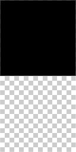
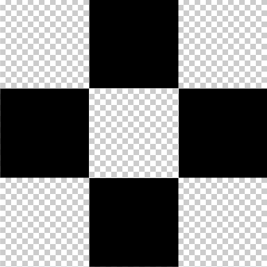

- [移动端 1px 问题](#移动端-1px-问题)
  - [Viewport meta 标签](#viewport-meta-标签)
  - [0.5px 方案](#05px-方案)
  - [border-image 方案](#border-image-方案)
  - [background-image 方案](#background-image-方案)
  - [box-shadow 方案](#box-shadow-方案)
  - [transform 方案](#transform-方案)
  - [postcss-write-svg 插件方案](#postcss-write-svg-插件方案)

## 移动端 1px 问题

在高分辨率（比如 Retina 屏幕）的移动设备上，`1px` 的线实际的显示效果会大于 `1px`，例如在 `dpr = 2` 时，会显示成 `2px`。

### Viewport meta 标签

通过设置 Viewport meta 标签的缩放比例来将 CSS 像素和物理像素的比例设置为 `1:1`，从而避免因为缩放导致的 `1px` 边框过粗问题，例如：

```html
<meta
  name="viewport"
  content="width=device-width,initial-scale=1.0,user-scalable=no"
/>
```

### 0.5px 方案

在 iOS8 及以后，开始支持 `0.5px`，因此我们可以通过媒体查询，根据 dpr 动态设置线条宽度：

```css
.border {
  border: 1px solid #eee;
}

@media (min-device-pixel-ratio: 2), (-webkit-min-device-pixel-ratio: 2) {
  .border {
    border-width: 0.5px;
  }
}
```

但是在 iOS7 及以下和 Android 机中，`0.5px` 会显示为 `0`，因此需要想办法进行 Hack：

- 通过判断 UserAgent

  ```js
  if (/iP(hone|od|ad)/.test(navigator.userAgent)) {
    var v = navigator.appVersion.match(/OS (\d+)_(\d+)_?(\d+)?/);
    var version = parseInt(v[1], 10);

    if (version >= 8) {
      document.documentElement.classList.add('hairlines');
    }
  }
  ```

  如果是 iOS8+ 版本，会在 `html` 元素上添加 `hairlines` 类名，然后使用该类名修改 CSS：

  ```css
  .hairlines .border {
    border-width: 0.5px;
  }
  ```

- 添加一个 DOM 元素进行检测

  ```js
  if (window.devicePixelRatio && devicePixelRatio >= 2) {
    var testElem = document.createElement('div');
    testElem.style.border = '.5px solid transparent';
    document.body.appendChild(testElem);

    if (testElem.offsetHeight == 1) {
      document.querySelector('html').classList.add('hairlines');
    }

    document.body.removeChild(testElem);
  }
  ```

  这段代码需要在浏览器加载完成才能执行，因此会引起一定的**重排**（注意不是重绘），所以更推荐第一种方法。

缺点：目前兼容性不太好，支持 CSS 的 `0.5px` 的设备不多。

### border-image 方案

> 关于 `border-image` 相关知识，**强烈**推荐阅读：[凹凸实验室：border-image 的正确用法](https://aotu.io/notes/2016/11/02/border-image/index.html)。如果没有理解 `border-image`，接下来的代码将很难看懂。

该方案需要配合特定的图片。举例如下：

- 实现一条线框（顶部）

  准备如下图片（图中黑色部分大小 `1px * 1px`，整个图片 `1px * 2px`）

  

  使用如下：

  ```css
  .border {
    border-width: 1px 0;
    border-style: solid;
    border-image: url(./img/line1.png) 2 0 0 0 stretch;
  }
  ```

  这段代码的作用是，将 `2px` 高的图片显示在 `1px` 的线框中，而图片中黑色部分只占一半，所以就实现了 `0.5px` 的效果。

  这样在 `dpr > 2` 的设备下，`1px` 的线框不管被转换为多少物理像素，实际显示的黑边只有 `1px`。但是在 `dpr = 1` 的设备中，看到的是极细的线，如果还想显示 `1px` 的线就需要用上文中提到的方法，通过判断 pdr 来处理了。

- 实现上下两条线框

  你可以使用上面的图片来实现两条线框，但是如果你追求 `0.5px` 的完美，那么你需要准备如下图片（图中黑色部分大小 `1px * 1px`，整个图片 `1px * 4px`）

  

  使用如下：

  ```css
  .border {
    border-width: 1px 0px;
    border-style: solid;
    border-image: url('border.png') 2 0 stretch;
  }
  ```

  这段代码的作用是，将图片从竖直方向上的中间分开，上半部分放入上边框，下半部分放入下边框，并且上下都是 `2px` 的图片放入 `1px` 的边框，从而实现 `0.5px` 的效果。

- 实现四条线框

  准备如下图片（图中黑色部分大小 `1px * 1px`，整个图片 `3px * 3px`）

  

  使用如下：

  ```css
  .border {
    border-width: 1px;
    border-style: solid;
    border-image: url('border.png') 1 1 1 1 stretch;
  }
  ```

  这里涉及到了 `border-image` 中的九宫格概念，明白了这个概念，这段代码的作用就简单了，这里不再赘述。

缺点：

- 修改颜色麻烦，需要替换图片
- 实现圆角麻烦，而且效果很不好

优点：你可以利用该方案，深入学习并理解 `border-image` 相关知识，尤其是其中的九宫格概念。

### background-image 方案

该方案和 border-image 方案类似，需要配合特定的图片，缺点同 border-image 方案。举例如下：

准备如下图片（图中黑色部分大小 `1px * 1px`，整个图片 `1px * 2px`）


代码如下所示：

```css
.border {
  background: url('border.png') repeat-x left bottom;
  background-size: 100% 1px;
}
```

但是该方案可以配合 CSS 渐变使用，原理是：设置 `1px` 的渐变，50% 有颜色，50% 设为透明，从而实现 `0.5px` 的效果。举例如下：

- 实现一条线框

  ```css
  .border {
    background-image: linear-gradient(0deg, red, red 50%, transparent 50%);
    background-size: 100% 1px;
    background-repeat: no-repeat;
    background-position: bottom;
  }
  ```

- 实现四条线框

  ```css
  .border {
    background: linear-gradient(#000, #000 100%, transparent 100%) left / 1px 100%
        no-repeat, linear-gradient(#000, #000 100%, transparent 100%) right / 1px
        100% no-repeat,
      linear-gradient(#000, #000 100%, transparent 100%) top / 100% 1px no-repeat,
      linear-gradient(#000, #000 100%, transparent 100%) bottom / 100% 1px no-repeat;
  }
  ```

缺点：

- 无法实现圆角（圆角的地方线框消失）
- 实际显示的效果不好（四条线框粗细不一）

### box-shadow 方案

该方案的原理是：利用阴影的扩散，再配合负的偏移值，从而实现 `0.5px` 的效果。举例如下：

- 实现一条线框

  ```css
  .border {
    box-shadow: 0 1px 1px -1px rgba(0, 0, 0, 1);
  }
  ```

- 实现四条线框

  ```css
  .border {
    box-shadow: 0 0 2px -1px rgba(0, 0, 0, 1);
  }
  ```

缺点：

- 颜色不好控制（在阴影扩散的边缘，颜色会减淡，但是减淡多少不容易知道）
- 实际效果有点模糊（由于实际显示的是扩散边缘，所以是发虚的）

优点：

- 适用于圆角（CSS 阴影和圆角的形状一致）
- 适用于一条线，多条线框。

### transform 方案

该方案一般要利用 CSS 伪元素，直接在元素上实现适用场景较少。原理是：画出 `1px` 的线，利用 `transform` 的 `scale` 旋转 50%，这样就实现了 `0.5px` 的效果。举例如下：

- 实现一条线框

  ```css
  .border::after {
    content: '';
    display: block;
    width: 100%;
    height: 1px;
    background-color: #000;
    transform: scaleY(0.5);
    transform-origin: center;
  }
  ```

- 实现四条线框

  ```css
  .border {
    position: relative;
    border: none;
  }

  .border::after {
    content: '';
    position: absolute;
    top: 0;
    left: 0;
    z-index: -1;
    box-sizing: border-box;
    border: 1px solid #000;
    width: 200%;
    height: 200%;
    transform: scale(0.5);
    transform-origin: left top;
  }
  ```

优点：即插即用，适合在老项目中使用。

### postcss-write-svg 插件方案

这是一个 PostCSS 的插件，项目地址：[postcss-write-svg](https://github.com/jonathantneal/postcss-write-svg)，使用示例：

- 配合 `border-image` 使用

  ```css
  @svg 1px-border {
    height: 2px;

    @rect {
      fill: var(--color, black);
      width: 100%;
      height: 50%;
    }
  }

  .border {
    border: 1px solid transparent;
    border-image: svg(1px-border param(--color #00b1ff)) 2 2 stretch;
  }
  ```

  经过 PostCSS 编译后，结果如下：

  ```css
  .border {
    border: 1px solid transparent;
    border-image: url("data:image/svg+xml;charset=utf-8,%3Csvg xmlns='http://www.w3.org/2000/svg' height='2px'%3E%3Crect fill='%2300b1ff' width='100%25' height='50%25'/%3E%3C/svg%3E")
      2 2 stretch;
  }
  ```

- 配合 `background-image` 使用

  ```css
  @svg square {
    @rect {
      fill: var(--color, black);
      width: 100%;
      height: 100%;
    }
  }

  .border {
    background-image: svg(square param(--color #00b1ff));
  }
  ```

  经过 PostCSS 编译后，结果如下：

  ```css
  .border {
    background-image: url("data:image/svg+xml;charset=utf-8,%3Csvg xmlns='http://www.w3.org/2000/svg'%3E%3Crect fill='%2300b1ff' width='100%25' height='100%25'/%3E%3C/svg%3E");
  }
  ```

缺点：依赖于 PostCSS 之类的工具。

优点：不考虑依赖工具的话，算是目前最完美的方案，推荐使用。
