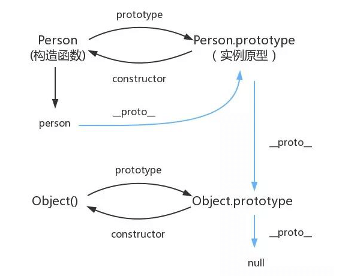
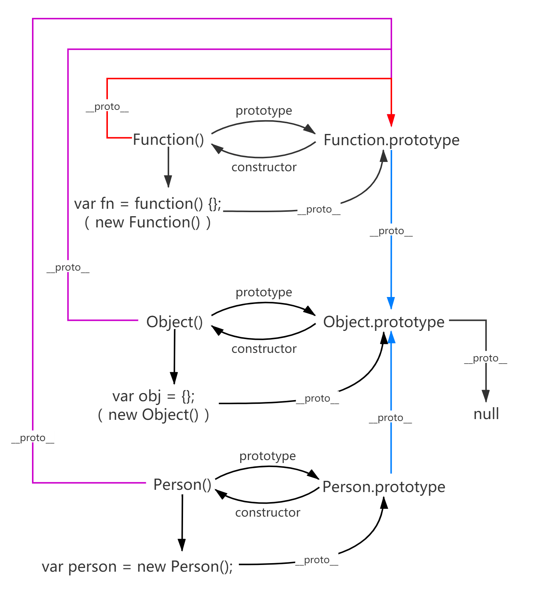

- [JavaScript 基础 1](#javascript-基础-1)
  - [原始数据类型](#原始数据类型)
  - [对象类型](#对象类型)
  - [类型转换](#类型转换)
    - [转为 Boolean](#转为-boolean)
    - [对象转为基本类型](#对象转为基本类型)
    - [类型转换的小技巧](#类型转换的小技巧)
    - [四则运算](#四则运算)
    - [比较运算](#比较运算)
    - [== 和 === 的区别](#-和--的区别)
  - [typeof v.s. instanceof](#typeof-vs-instanceof)
    - [typeof 原理](#typeof-原理)
    - [手写 instanceof](#手写-instanceof)
  - [this](#this)
    - [bind 这类改变上下文的 API](#bind-这类改变上下文的-api)
    - [箭头函数的 this](#箭头函数的-this)
    - [其他方面的 this](#其他方面的-this)
    - [this 总结](#this-总结)
  - [闭包](#闭包)
    - [闭包的用途](#闭包的用途)
    - [两个思考题](#两个思考题)
    - [关于闭包，面试必问的问题](#关于闭包面试必问的问题)
  - [深浅拷贝](#深浅拷贝)
    - [浅拷贝](#浅拷贝)
    - [深拷贝](#深拷贝)
  - [原型链](#原型链)

# JavaScript 基础 1

## 原始数据类型

> 涉及面试题：原始类型有哪几种？`null` 是对象吗？

- `boolean`
- `number`
- `string`
- `null`
- `undefined`
- `symbol` - ES6 新引入的基本类型

需要注意的地方：

- 基本类型存的是值，没有任何方法和属性

  > 例如，虽然 `'1'.toString()` 可以使用，但这是因为 `'1'` 已经被后台转换为了基本包装类型；即 `'1'` 被转换成了 `String` 类型，所以可以调用 `toString` 方法。

- `null` 不是对象类型的

  > 虽然 `typeof null` 得到的结果是 `object`，但是这是一个[历史遗留的 Bug](https://developer.mozilla.org/zh-CN/docs/Web/JavaScript/Reference/Operators/typeof#null) 造成的。

- `number` 类型是浮点类型的

  > 因此会在使用时出现 Bug，例如：`0.1 + 0.2 != 0.3`。

- `string` 类型是不可变的

  > 无论你在 `string` 类型的值上调用任何方法，都不会对值有任何改变。

## 对象类型

> 涉及面试题：对象类型和原始类型的不同之处？函数参数是对象会发生什么问题？

在 JS 中，除了原始类型，其他的都是对象类型。原始类型和对象类型之间的不同之处是：**原始类型存储的是指，对象类型存储的是地址（指针）**。

对象类型在赋值、传参时，传递的是地址。因此，一方值变化，另一方的值也变化。这就是为什么对象传给函数之后，可以在函数内部被修改。举例如下：

```js
function test(person) {
  person.age = 20;
  person = { name: 'bar', age: 21 };

  return person;
}

var p1 = { name: 'foo', age: 22 };
var p2 = test(p1);

console.log(p1.age); // => 20
console.log(p2.age); // => 21
```

> 要知道 JavaScript 中，**函数传参时，只有值传递**。

由于变量存的是对象的地址（指针），因此把 `p1` 传给 `test` 函数时，按值传递的是 `p1` 存储的地址。

这样，在 `test` 函数内 `person.age = 20;` 代码中，`person` 按地址找到对象，这个对象就是外面的 `{ name: 'foo', age: 22 }`，因此函数里的修改会影响到外面。

而函数里 `person = { name: 'bar', age: 21 };` 相当于又开辟了一个新的内存，其中存储了 `{ name: 'bar', age: 21 }` 对象的地址，并赋给 `person`，因此 `p2.age => 21`

## 类型转换

- `NaN` 是 `number` 类型
- `null` 转数字：`0`。
- `undefined` 转数字：`NaN`
- 对象转字符串：`[object Object]`。
- 数组转数字：空数组转为 0，只有一个数字的数组转为数字，其余情况均为 `NaN`。

具体转换规则如图：


> 其中，`Symbol` 转字符串时，使用隐式方式（例如：`Symbol('foo') + 'bar'`）转换会报错。需要显示转换，如下所示：
>
> ```js
> console.log(Symbol('foo').toString());
> // => "Symbol('foo')"
> ```

总的来说，JS 中类型转换只有三种情况，分别是：

- 转为布尔值
- 转为数字
- 转为字符串

### 转为 Boolean

JavaScript 中只有 6 个假值：

- `undefined`
- `null`
- `NaN`
- `0/-0/+0`
- `''`（空字符串）
- `false`

其余任何值转为 Boolean 时都为 true。

### 对象转为基本类型

对象在转换为基本类型时，会调用内置的 `[[ToPrimitive]]` 函数，该函数的算法逻辑如下：

- 如果已经是基本类型，直接返回
- 如果是转为字符串，就调用 `toString`，结果是基本类型的话，返回转换的值
- 如果不是转为字符串，先调用 `valueOf`，结果是基本类型的话，返回转换的值；结果不是基本类型的话，再调用 `toString`
- 如果都没有返回基本类型的值，抛出错误

当然，也可以自己重写对象的 `Symbol.toPrimitive` 方法（该方法在对象转基本类型时，调用优先级最高）：

```js
let a = {
  valueOf() {
    return 0;
  },
  toString() {
    return 1;
  },
  [Symbol.toPrimitive]() {
    return 2;
  }
};

console.log(1 + a); // => 3
```

### 类型转换的小技巧

- 数据前置 `+` 号，转换为 `number` 类型
- 数据与 `0` 相减，转换为 `number` 类型
- 数据前置 `!!` 号，转换为 `boolean` 类型

### 四则运算

四则运算中，`+` 号运算符相较其他运算符比较特殊，它的特点如下：

- 运算的结果只有数字和字符串
- 只要运算中存在字符串，结果就为字符串

举例如下：

```js
console.log([1, 2, 3] + 4); // 1,2,34
```

由于 `[1, 2, 3]` 无法转换为数字，所以会转换为字符串 `1,2,3` 所以，再与 `4` 相加就会得到上面的结果。

下面来看这个表达式：

```js
console.log('a' + +'b'); // => aNaN
```

就优先级而言，类型转换大于四则运算，所以首先 `+'b'` 转换为 `NaN`，因此结果为 `aNaN`。同理，这就是为什么 `('b' + 'a' + + 'a' + 'a').toLowerCase()` 的结果为 `banana`。

四则运算中，除了加法运算以外，对于其他三种运算来说“所有操作数都尝试转为数字；如果都无法转为数字，则返回 `NaN`：

```js
console.log([2] - '3'); // => -1
console.log('2' * []); // => 0
console.log(2 / [1, 2]); // => NaN
```

总的来说，JavaScript 中的四则运算就两点：

1. 加法，结果只有**数字和字符串**（操作数含有字符串，则结果就是字符串）
2. 减法、乘法、除法，结果只有**数字和 `NaN`**（操作数都能转为数字，则结果为数字；否则结果为 `NaN`）

### 比较运算

1. 如果操作数全是对象，就通过调用 `toPrimitive` 转换对象
2. 如果操作数全是字符串，就比较字符的 `unicode` 索引
3. 其余情况，转为数字后进行比较

举例如下：

```js
// 全为对象
Number(1) > Number([])    // => true
Number([1]) > Number('2') // => false

// 全为字符串
'1' < '2'   // => true
'1' > '02'  // => true

// 其余情况（举例部分）
true > 0    // => true
true == '1' // => true
[] == ''    // => true
[1] > false // => true
```

### == 和 === 的区别

简单来说，使用 `==` 先比较类型，如果类型一样再比较值；如果类型不一样，会尝试 **类型转换**，转换成功后再比较值。而使用 `===` 只比较值，不会进行类型转换。

**通过 `==` 判断两者是否相同，判断流程如下：**

1. 两者类型是否相同，相同就再比较大小
2. 类型不同，进行**类型转换**
3. 两者类型是否分别为 `null` 和 `undefined`；如果是，直接返回 `true`（即 `null == undefined` 为 `true`）
4. 两者类型是否分别为 `number` 和 `string`，如果是，将**字符串**转换为 `number`
5. 是否存在 `boolean`，如果存在将 `boolean` 转换为 `number`
6. 是否一方为 `object`，另一方为 `number、string、symbol`，是的话将 `object` 转换为基本类型

例子如下：

```js
// 例 1
1 == '2' // 第四点
      ↓
1 ==  2  // => false

// 例 2
'1' == true // 第五点
        ↓
'1' ==  1   // 第四点
 ↓
 1  ==  1   // => true

// 例 3
'1' == { name: 'liuyib' } // 第六点
               ↓
'1' == '[object Object]'  // => false
```

> 思考题：请问 `[] == ![]` 的结果是什么？

<details>
<summary>
点击查看思考题答案
</summary>

```md
1. 首先，![] 会被转换为 false（操作符 ! 的优先级大于 == 操作符）
2. 式子变为 [] == false
3. 根据第五点可知，存在布尔值时，将其转为数字
4. 式子变为 [] == 0
5. 由于式子又符合了第六点，所以被转换为 0 == 0
6. 所以结果为 true
```

</details>

关于 `===` 就很简单了，由于不会发生类型转换，因此只要类型不同就返回 `false`；类型相同时，按每种类型的比较规则进行比较。

## typeof v.s. instanceof

> 涉及面试题：`typeof` 是否能正确判断类型？`instanceof` 能正确判断对象的原理是什么？

- `typeof` 对于基本类型来说，除了 `null` 都可以显示正确类型
- `typeof` 对于对象来说，除了函数，都显示 `object`
- `instanceof` 可以正确判断类型的原理是，其内部是通过原型链实现的

不过 `instanceof` 不能用于判断基本类型：

```js
var str = 'hello world';
console.log(str instanceof String); // => false

var str = new String('hello world');
console.log(str instanceof String); // => true
```

但是有另一种方式，让 `instanceof` 可以判断基本类型：

```js
class PrimitiveString {
  static [Symbol.hasInstance](x) {
    return typeof x === 'string';
  }
}

console.log('hello world' instanceof PrimitiveString); // true
```

其中 `Symbol.hasInstance` 是一个能让我们自定义 `instanceof` 行为的东西。上面的代码等同于 `typeof 'hello world' === 'string'`，所以结果就是 `true` 了。

### typeof 原理

谈 `typeof` 的原理之前，需要了解 JS 底层如何存储数据的类型信息。

在 JS 最初实现的时候，JS 中的值是由一个**表示类型的标签**和**实际的数据值**组成。变量的类型标签存储在机器码的低 1~3 位，有以下几种：

- 000：对象
- 010：浮点数
- 100：字符串
- 110：布尔值
- 1：整数

但是，有两个值很特别：

- `undefined`：用 `-2^30`（整数范围之外的数字）来表示
- `null`：其机器码全为 0

因此 `typeof null` 错误的返回 `object`。

### 手写 instanceof

`instanceof` 的原理很简单，就是判断左边变量是不是右边变量的实例。

因此想要实现一个 `instanceof`，只需要沿左边变量的原型链，一直向上查找，如果能找到右边变量，返回 `true`，否则，返回 `false`。

代码如下：

```js
function instanceof(a, b) {
  var left = a.__proto__;
  var right = b.prototype;

  while (true) {
    if (left === null) return false;
    if (left === right) return true;

    left = left.__proto__;
  }
}
```

## this

> 涉及面试题：如何正确判断 `this`？箭头函数的 `this` 是什么？

`this` 这个概念并不难，只是很多文章把简单的东西说复杂了。

首先来看几个使用场景：

```js
var a = 1;
var obj = {
  a: 2,
  foo: foo
};

function foo() {
  console.log(this.a);
}

// 直接调用方式
foo();

// 作为对象属性调用
obj.foo();

// 使用 new 关键字
var b = new foo();
```

下面对这几种用法进行分析：

- 直接调用 `foo`（称为**默认绑定**）不管 `foo` 函数放在哪里，`this` 都是全局对象（`window`、`global`）
- 对于 `obj.foo` 这种用法（称为**隐式绑定**）只需要记住，谁调用了函数，`this` 就指向谁
- 对于 `new` 的方式来说，`this` 永远被绑定在了实例上，**任何方式**都无法改变 `this`

### bind 这类改变上下文的 API

其中 `call` 和 `apply` 除了接收参数不同外，修改 `this` 时的行为都一样。因此，这里将它俩归在一起。

`bind` 和 `call/apply` 的异同如下：

- 相同：都会修改函数中的 `this`，并将 `this` 指向传入的对象
- 不同

  - `bind`：修改 `this` 后，返回一个硬编码的**新函数**，需要手动执行新函数
  - `call/apply`：不返回新函数，修改 `this` 后会立即执行**原函数**

看明白下面的代码，`bind` 和 `call/apply` 的区别就清楚了：

```js
function foo() {
  console.log(this.a);
}

var obj1 = { a: 1, foo: foo };
var obj2 = { a: 2 };
var obj3 = { a: 3 };
var a = 4;

var bar = obj1.foo;
// call 将 this 指向 obj2，并立即执行原函数
bar.call(obj2); // => 2
obj1.foo(); // => 1

var baz = bar.bind(obj3);
// bind 修改 this 后，返回硬编码的新函数，需要手动执行
baz(); // => 3
// 调用 bar 并不等价于调用 obj1.foo，而是等价于直接调用 foo
// 因此 this 丢失（隐式绑定 this 丢失），应用默认绑定规则
bar(); // => 4
```

如果对一个函数多次使用 `bind`，那么上下文（`this` 的值）会是什么呢？

```js
var a = {};
var fn = function () {
  console.log(this);
};

fn.bind().bind(a)(); // => window
```

上面的 `fn` 为什么会被绑定到 `window` 上？其实 `fn.bind().bind(a)` 等价于：

```js
var fn2 = function fn1() {
  return function () {
    return fn.apply();
  }.apply(a);
};
fn2();
```

所以可以看出，不管给函数 `bind` 几次，函数的 `this` 永远由第一次 `bind` 决定。再举个例子验证一下：

```js
var obj = { a: 1 };
var fn = function () {
  console.log(this);
};

fn.bind(obj).bind()(); // => { a: 1 }
```

> 对于 `bind` / `call` / `apply`，如果第一个参数为 `null`、`undefined` 或 `不传`，那么就会应用默认绑定规则，也就是函数中的 `this` 会泄漏到全局对象（`window`, `global`）上。
>
> 为了防止这个副作用，可以通过传一个空对象 `∅ = Object.create(null)` 来保护全局对象。

### 箭头函数的 this

首先要知道，箭头函数没有 `this`，它的 `this` 只取决于包裹箭头函数的第一个普通函数的 `this`。举个例子：

```js
function foo() {
  return () => {
    return () => {
      console.log(this);
    };
  };
}

foo()(); // => window
```

这个例子中，由于包裹箭头函数的第一个普通函数是 `foo`，所以很显然结果为 `window`。

另外，对箭头函数使用 `call、apply、bind` 这类函数是无效的（箭头函数没有 `this` 嘛，因此绑定上下文的函数无法生效）。

### 其他方面的 this

- 隐式绑定中 `this` 丢失

  ```js
  function foo() {
    console.log(this.a);
  }

  var obj = { a: 1, foo: foo };
  var a = 2;
  var bar = obj.foo;

  // 隐式绑定
  obj.foo(); // => 1

  // 给隐式绑定起别名后，直接调用别名就会出现 this 丢失的问题
  bar(); // => 2
  ```

- 隐式绑定中多次调用

  ```js
  function foo() {
    console.log(this.a);
  }

  var obj3 = { a: 3, foo: foo };
  var obj2 = { a: 2, obj3: obj3 };
  var obj1 = { a: 1, obj2: obj2 };

  // 多次调用时，this 的指向只取决于最后一次
  obj1.obj2.obj3.foo(); // => 3
  ```

- 严格模式下的 `this`

  严格模式主要影响 `this` 的默认绑定规则，但是不影响函数调用中的 `this`。来看下面的代码：

  ```js
  var a = 1;

  function foo() {
    'use strict';

    console.log(this.a);
  }

  foo(); // TypeError: Cannot read property 'a' of undefined

  // 由于严格模式的限制，foo 函数中 this 的默认绑定规则失效了。
  ```

  ```js
  var a = 1;

  function foo() {
    console.log(this.a);
  }

  (function () {
    'use strict';

    foo(); // => 1
  })();

  // foo 函数中不是严格模式，其中 this 的默认绑定规则仍有效
  // 并且调用时，其 this 不受外界严格模式的影响
  ```

  通常来说，不应该在代码中混用 `strict` 模式和非 `strict` 模式。上述情况主要出现在调用第三方库时，其严格程度和你的代码可能有所不同，因此需要注意此类兼容细节。

### this 总结

- 当多个规则同时出现，就需要根据**优先级**来决定 `this` 最终指向哪里。优先级情况如下：

  **`new` 关键字 > `bind` 这类函数 > `obj.foo()` 这种方式 > 直接调用**

- 箭头函数没有自己的 `this`，仅继承外层函数的，因此无法通过 `bind/call/apply` 修改。
- 隐式绑定中，要注意 `this` 丢失的问题
- 隐式绑定中，多次调用时 `this` 只取决于最后一次
- 严格模式会使 `this` 的默认绑定失效，但不影响函数调用中的 `this`

## 闭包

> 涉及面试题：什么是闭包？

所谓闭包，就是**能够访问其他函数内部变量的函数**。

### 闭包的用途

1. 读取/设置一个函数内部的私有变量
2. 让变量的值始终保持在内存中

来看一个例子：

```js
var add = null;

function f1() {
  var n = 999;

  add = function () {
    n += 1;
  };

  function f2() {
    console.log(n);
  }

  return f2;
}

var result = f1();

result(); // => 999

add();

result(); // => 1000
```

上面代码的执行结果，第一次为 `999`，第二次为 `1000`。这就证明了，函数 `f1` 中的局部变量一直保存在内存中，并没有在 `f1` 被调用后被清除。

为什么会这样？原因是因为 `f1` 是 `f2` 的父函数，`f2` 被返回赋给了全局变量 `result`，这就导致 `f2` 始终保存在内存中，而 `f2` 的存在依赖于 `f1` 的存在，所以 `f1` 也始终保存在内存中，而不是被垃圾回收机制回收。

这段代码中有一个值得注意的地方，就是 `add = function () { n += 1 }` 这一行，`add` 的值是一个匿名函数，而这个匿名函数本身也是一个闭包，所以 `add` 的作用就相当于 `setter`，可以在函数外部对函数内部的局部变量进行操作。

### 两个思考题

如果能理解这两个思考题，应该就算理解闭包的运行机制了。

思考题 1：

```js
var name = 'The Window';

var object = {
  name: 'My Object',

  showName: function () {
    return function () {
      return this.name;
    };
  }
};

console.log(object.showName()());
```

思考题 2：

```js
var name = 'The Window';

var object = {
  name: 'My Object',

  showName: function () {
    var _this = this;
    return function () {
      return _this.name;
    };
  }
};

console.log(object.showName()());
```

<details>
<summary>
点击查看思考题答案
</summary>

```text
1. The Window
2. My Object
```

</details>

### 关于闭包，面试必问的问题

```js
var data = [];

for (var i = 0; i < 3; i++) {
  data[i] = function () {
    console.log(i);
  };
}

data[0]();
data[1]();
data[2]();
```

对于上面的输出结果，很显然都是 `3`。至于为什么都是 3，可以这样来理解：循环结束后，上面的代码等价于：

```js
data[0] = function () {
  console.log(i);
};
data[1] = function () {
  console.log(i);
};
data[2] = function () {
  console.log(i);
};
```

此时 `i` 的值已经为 3 ，所以当 `data[0]、data[1]、data[2]` 中任意一个执行时输出结果都为 `3`。

用闭包解决上面的问题：

```js
var data = [];

for (var i = 0; i < 3; i++) {
  (function (i) {
    data[i] = function () {
      console.log(i);
    };
  })(i);

  // 或者写成下面这种形式
  // data[i] = (function(i) {
  //   return function() {
  //     console.log(i);
  //   };
  // })(i);
}

data[0](); // => 0
data[1](); // => 1
data[2](); // => 2
```

当然更简单的方法就是使用 `let`。

## 深浅拷贝

> 涉及面试题：什么是浅拷贝？如何实现浅拷贝？什么是深拷贝？如何实现深拷贝？

**浅拷贝**：只复制某个对象的地址（指针），而不复制对象本身，新旧对象共用一个内存地址；修改新对象会影响旧对象。
**深拷贝**：会复制出一个一模一样的对象，新对象和旧对象不共享内存地址；修改新对象不会影响旧对象。

对象类型在赋值的过程中，实际拷贝的是地址；因此修改其中一方的值，另一方的值也会随之变化。为了解决这一问题，我们通常使用浅拷贝的方式来复制对象。

### 浅拷贝

1. `for...in` 遍历

   ```js
   let obj = { a: 1, b: { c: 1 } };

   function shallowCopy(obj) {
     let newObj = {};
     for (const key in obj) {
       if (obj.hasOwnProperty(key)) {
         const value = obj[key];

         newObj[key] = value;
       }
     }
     return newObj;
   }

   let newObj = shallowCopy(obj);
   obj.a = 2;
   obj.b.c = 2;

   console.log(newObj.a); // => 1 // 不变
   console.log(newObj.b.c); // => 2 // 改变
   ```

2. `...` 运算符

   ```js
   let obj = { a: 1, b: { c: 1 } };

   let newObj = { ...obj };
   obj.a = 2;
   obj.b.c = 2;

   console.log(newObj.a); // => 1 // 不变
   console.log(newObj.b.c); // => 2 // 改变
   ```

3. `Object.assign`

   ```js
   let obj = { a: 1, b: { c: 1 } };

   let newObj = Object.assign({}, obj);
   obj.a = 2;
   obj.b.c = 2;

   console.log(newObj.a); // => 1 // 不变
   console.log(newObj.b.c); // => 2 // 改变
   ```

   可以看出，进行浅拷贝时，如果对象的属性值还是对象，则拷贝的是引用地址。为了解决这个问题，就需要用到深拷贝。

### 深拷贝

1. `JSON.parse(JSON.stringify())`

   一般情况下，使用这个方法就能解决问题：

   ```js
   let obj = { a: 1, b: { c: 1 } };

   let newObj = JSON.parse(JSON.stringify(obj));
   obj.a = 2;
   obj.b.c = 2;

   console.log(newObj.a); // => 1 // 不变
   console.log(newObj.b.c); // => 1 // 不变
   ```

   这个方法局限性如下：

   - 会忽略**函数、`undefined`、`Symbol`**（`null` 不会被忽略）
   - 不能正确拷贝正则表达式（会拷贝为空对象 `{}`）
   - 循环引用报错
   - 相同的引用会被重复拷贝

   ```js
   let obj = {
     a: 'hello world',
     b: undefined,
     c: Symbol('male'),
     d: function () {},
     e: /^coding$/
   };
   let newObj = JSON.parse(JSON.stringify(obj));

   console.log(newObj); // => { a: "hello world", e: {} }
   ```

   可以看到，拷贝时忽略了函数、`undefined`、`symbol`；正则表达式被拷贝为一个空对象 `{}`。

2. `MessageChannel`

   如果你要拷贝的对象含有内置类型，并且**不包含函数**，那么可以使用 `MessageChannel`：

   ```js
   function structuralClone(obj) {
     return new Promise((resolve) => {
       const { port1, port2 } = new MessageChannel();
       port2.onmessage = (ev) => resolve(ev.data);
       port1.postMessage(obj);
     });
   }

   const obj = {
     a: undefined,
     b: { c: 1 }
   };

   // 循环引用
   obj.b.d = obj.b;

   let test = async () => {
     const newObj = await structuralClone(obj);
     obj.b.c = 2;
     console.log(newObj); // 输出结果如图
   };

   test();
   ```

   

   可以看到，这种方法**可以拷贝 `undefined` 并且能处理循环引用**，但是这种方法仍**不能拷贝函数**，如果对象有属性是函数，使用这个方法深拷贝会报错。

总的来说，想实现一个深拷贝是很困难的，需要考虑很多边界情况，例如：处理原型链、如何处理 DOM 等。因此实际使用中，推荐使用 [lodash 的深拷贝函数](https://lodash.com/docs/4.17.15#cloneDeep)。

## 原型链

> 涉及面试题：如何理解原型？如何理解原型链？

例如，有以下代码：

```js
var person = new Person();
```

则其对应的原型链如下：



如果再包含 `Object()` 和 `Function()`，则完整版本如下：



上图看上去有些复杂，其实就三点：

1. 所有函数的隐式原型（`__proto__`），都指向 `Function.prototype`

   > - 除 `Function()` 本身外，所有函数都是通过 `new Function()` 创建的。
   > - 我们平时使用的 `function xxx() {}` 也不过是语法糖，其底层会调用 `new Function()` 来创建函数。
   > - 但是 `Function()` 也指向 `Function.prototype`，这就产生了自己创建自己的问题。至于为什么，也仅是在 JS 最初设计的时候，为了满足“所有构造函数，都指向 `Function.prototype`”，避免产生混乱。实际上，引擎会先创建 `Function.prototype`，然后才有 `Function()`。

2. 所有构造函数的显式原型（`prototype`），都指向 `Object.prototype`

   > - 只要是对象，在底层就会通过 `new Object()` 来创建。而构造函数的原型也是对象，因此也会通过 `new Object()` 创建，所以构造函数的隐式原型都指向 `Object.prototype`。
   > - 有个疑问是 `Object.prototype` 也是对象，如果它也是通过 `new Object()` 创建的，就会产生自己创建自己的问题。其实 `Object.prototype`是由引擎创建的，由于它不需要通过其他对象来创建，所以直接指向 `null`。

3. 实例、构造函数、原型之间，形成一个环形指向

   > 它们的指向关系是：由构造函数 `new` 出实例，然后实例的隐式原型（`__proto__`）指向构造函数的显示原型（`prototype`）。

---

参考资料：

- [深度解析原型中的各个难点](https://github.com/KieSun/Dream/issues/2)
