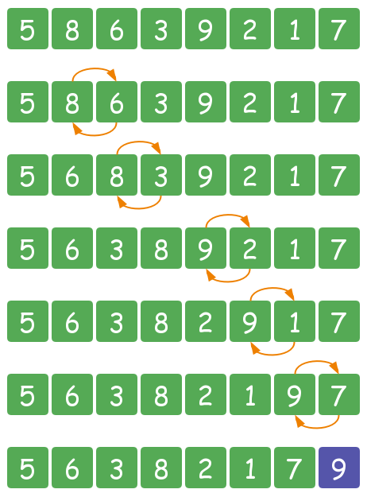
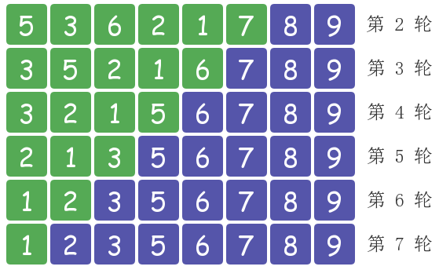
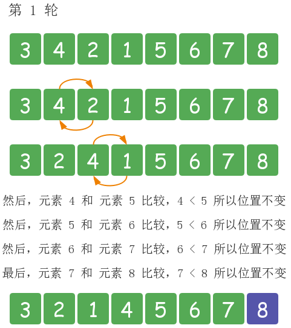
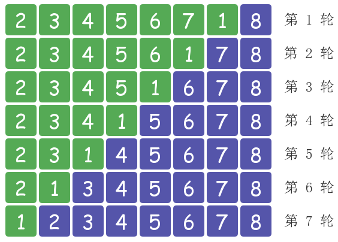
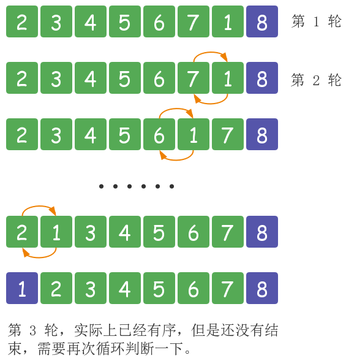

# 排序算法 JS 实现

## 冒泡排序

### 介绍

冒泡排序，英文名叫 bubble sort。之所以叫做冒泡排序，是因为元素可以想气泡那样，根据自身大小，一点点向数组一侧移动。它是一种**稳定排序**。

首先看一个例子，有一个无序数组 `[5, 8, 6, 3, 9, 2, 1, 7]` 对其按照从小到大进行冒泡排序。按照冒泡排序的思想，要把**元素之间两两进行比较，当左侧元素大于右侧元素时交换它们的位置，否则位置不变**。



然后重复上述过程，进行后面几轮排序后的结果如下。



到这为止，整个数组就变得有序了。上述就是冒泡排序的整体思路。

### 代码实现

``` js
function bubble_sort(arr) {
  for (var i = 0; i < arr.length - 1; i++) {
    for (var j = 0; j < arr.length - i - 1; j++) {
      var tmp = 0;

      if (arr[j] > arr[j + 1]) {
        tmp = arr[j];
        arr[j] = arr[j + 1];
        arr[j + 1] = tmp;
      }
    }
  }
}
```

### 性能优化

（1）加标志位

仍然以上述无序数组为例，当排到第 6、7 轮时，状态如下。


可以看到，当排到第 6 轮 的时候，数组已经有序。不过排序算法还是会进行第 7 轮排序，所以这是第一个可以优化的点。当数组有序后，进行标记，那么后面的几轮排序就可以不必进行。

冒泡排序第 2 版如下：

``` js
function bubble_sort2(arr) {
  for (var i = 0; i < arr.length - 1; i++) {
    // 数组是否已经排好序
    var isSorted = true;

    for (var j = 0; j < arr.length - i - 1; j++) {
      var tmp = 0;

      if (arr[j] > arr[j + 1]) {
        tmp = arr[j];
        arr[j] = arr[j + 1];
        arr[j + 1] = tmp;
        // 只要有元素交换，都将标记转为 false
        isSorted = false;
      }
    }

    if (isSorted) break;
  }
}
```

（2）增加有序区

下面以一个新的无序数组为例。


如果仍然按照上述算法进行排序，那么排序过程如下。



可以看出，循环到后面时，数组已经有序了。但排序算法仍会进行元素比较，所以这是第二个可以优化的点。我们可以记录最后一次进行元素交换的位置，这个位置就是无序元素的边界，再往后就是有序的了。

冒泡排序第 3 版如下：

``` js
function bubble_sort3(arr) {
  //记录最后一次交换的位置
  var lastExchangeIndex = 0;
  // 无序区的边界
  var sortBorder = arr.length - 1;
  var tmp = 0;

  for (var i = 0; i < arr.length - 1; i++) {
    // 数组是否已经排好序
    var isSorted = true;

    for (var j = 0; j < sortBorder; j++) {
      if (arr[j] > arr[j + 1]) {
        tmp = arr[j];
        arr[j] = arr[j + 1];
        arr[j + 1] = tmp;
        // 只要有元素交换，都将标记转为 false
        isSorted = false;
        lastExchangeIndex = j;
      }
    }
    sortBorder = lastExchangeIndex;

    if (isSorted) break;
  }
}
```

（3）升级版 -- 鸡尾酒排序

鸡尾酒排序相当于冒泡排序的升级版。传统的冒泡排序是进行元素单向交换，而鸡尾酒排序是在此基础上对元素进行双向交换。这样做是为了解决下面这个问题。

以下面这个无序数组为例。


按照之前的冒泡排序算法进行排序，过程如下。



可以看到，这个数组中，只有元素 1 的位置不对，却还要进行 7 轮排序。所以这就是鸡尾酒排序要解决的问题。解决方法很简单，只需要将之前冒泡排序的单向排序改为双向排序即可，过程如下。



这就是鸡尾酒排序的思路。由于整个排序过程左右来回循环，所以又叫双向冒泡排序 (Bidirectional Bubble Sort)、波浪排序 (Ripple Sort)、摇曳排序 (Shuffle Sort)、飞梭排序 (Shuttle Sort) 和欢乐时光排序 (Happy Hour Sort) 等等。

冒泡排序第 4 版 -- 鸡尾酒排序：

``` js
function cocktail_sort(arr) {
  var i, left = 0, right = arr.length - 1;
  var temp;

  while (left < right) {
    var isSorted = true;

    // 从左向右循环
    for (i = left; i < right; i++) {
      if (arr[i] > arr[i + 1]) {
        temp = arr[i];
        arr[i] = arr[i + 1];
        arr[i + 1] = temp;
        isSorted = false;
      }
    }
    right--;

    // 从右向左循环
    for (i = right; i > left; i--) {
      if (arr[i - 1] > arr[i]) {
        temp = arr[i];
        arr[i] = arr[i - 1];
        arr[i - 1] = temp;
        isSorted = false;
      }
    }
    left++;

    if (isSorted) break;
  }
};
```

鸡尾酒排序的优势是在大部分元素已经有序的情况下，可以快速排序。

## 快速排序


## 堆排序

## 计数排序

## 桶排序