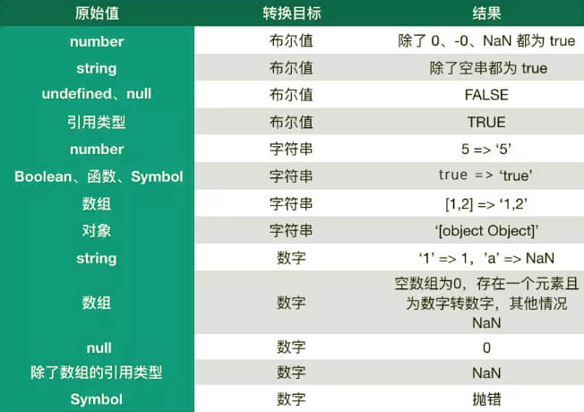
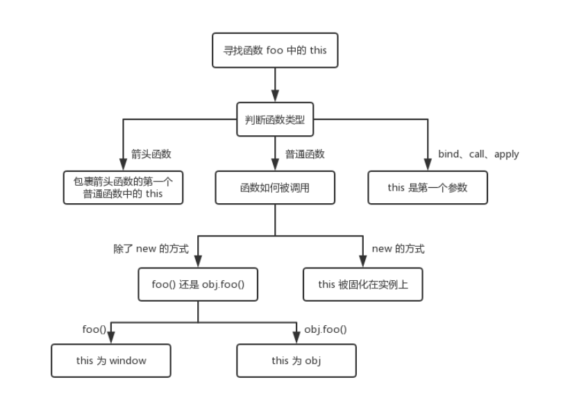
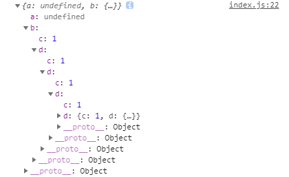

# JavaScript 知识总结

> - 这部分的知识总结，大部分来源于对掘金小册 [《前端面试之道》](https://juejin.im/book/5bdc715fe51d454e755f75ef) 的学习。
> - 文中提到的：实现一个 xxx，表示实现其原理，并不代表将其功能完全实现。

涉及的知识点参考了下图中的 JS 部分：


## 1、基本数据类型 6 种（原始数据类型）

- `boolean`
- `number`
- `string`
- `null`
- `undefined`
- `symbol` - ES6 新引入的基本类型

需要注意的地方：

- 基本类型中存储的都是值，没有任何方法和属性（虽然 `'1'.toString()` 可以使用，是因为这里 '1' 已经被后台转换为了基本包装类型）。
- `null` 不是对象类型的（虽然 `typeof null` 得到的结果是 `object`，但是这是一个[历史遗留的 Bug](https://developer.mozilla.org/zh-CN/docs/Web/JavaScript/Reference/Operators/typeof#null) 造成的）。
- `number` 类型是浮点类型的（`0.1 + 0.2 != 0.3`）。

## 2、typeof 和 instanceof

- `typeof` 对于基本类型来说，除了 `null` 都可以显示正确类型。
- `typeof` 对于对象来说，除了函数，都显示 `object`。

`instanceof` 可以正确判断数据类型，是因为其内部是通过原型链来判断的。

不过 `instanceof` 不能用于判断基本类型：

```javascript
var str = 'hello world';
console.log(str instanceof String); // => false

var str = new String('hello world');
console.log(str instanceof String); // => true
```

但是有另一种方式，让 `instanceof` 可以判断基本类型：

```javascript
class PrimitiveString {
  static [Symbol.hasInstance](x) {
    return typeof x === 'string';
  }
}

console.log('hello world' instanceof PrimitiveString); // true
```

其中 `Symbol.hasInstance` 是一个能让我们自定义 `instanceof` 行为的东西。上面的代码等同于 `typeof 'hello world' === 'string'`，所以结果就是 `true` 了。

### typeof 原理

谈 typeof 的原理之前，需要了解 JS 底层如何存储数据的类型信息。

在 JS 最初实现的时候，JS 中的值是由一个表示类型的标签和实际的数据值组成。类型标签存储在变量的机器码的低 1~3 位，有以下几种：

- 000：对象
- 010：浮点数
- 100：字符串
- 110：布尔值
- 1：整数

但是，有两个值很特别：

- `undefined`：用 `-2^30`（整数范围之外的数字）来表示。
- `null`：代表空指针，所有机器码均为 0。

因此 `typeof null` 错误的返回 `object`。

### 手动实现一个 instanceof

`instanceof` 的原理很简单，就是判断左边变量是不是右边变量的实例。

因此想要实现一个 `instanceof`，只需要沿左边变量的原型链，一直向上查找，如果能找到右边变量，返回 `true`，否则，返回 `false`。

代码如下：

```javascript
function my_instanceof(a, b) {
  var left = a.__proto__;
  var right = b.prototype;

  while (true) {
    if (left === null) return false;
    if (left === right) return true;

    left = left.__proto__;
  }
}
```

## 3、类型转换

- `NaN` 是 `number` 类型的数据，所以 `number` 转其他类型时不要漏掉它。
- 对象转字符串，结果为：`[object Object]`。
- 数组转数字：空数组、只有一个数字元素的数组转为数字，其余情况均为 `NaN`。
- `undefined` 和 `null` 转数字，分别为：`NaN` 和 `0`。

具体转换规则如图：



总的来说，JS 中类型转换只有三种情况，分别是：

- 转为布尔值
- 转为数字
- 转为字符串

### 转为 Boolean

除了 `undefined`，`null`，`false`，`NaN`，`0`，`-0` 转为 `false`，其他的都转为 `true`（所有对象转为布尔值，结果都为 `true`）。

### 对象转为基本类型

对象在转换为基本类型时，会调用内置的 `[[ToPrimitive]]` 函数，该函数的算法逻辑如下：

- 如果已经是基本类型，直接返回。
- 如果是转为字符串，就调用 `toString`，结果是基本类型的话，返回转换的值。如果不是转为字符串，先调用 `valueOf`，结果不是基本类型的话，再调用 `toString`。
- 调用 `valueOf`，结果是基本类型的话，返回转换的值。
- 如果都没有返回基本类型的值，就会抛错

当然，也可以自己重写对象的 `Symbol.toPrimitive` 方法（该方法在对象转基本类型时，调用优先级最高）：

```javascript
let a = {
  valueOf() {
    return 0;
  },
  toString() {
    return 1;
  },
  [Symbol.toPrimitive]() {
    return 2;
  }
};

console.log(1 + a); // => 3
```

### 类型转换的一些小技巧

- 数据前置 `+` 号，转换为 `number` 类型
- 数据与 `0` 相减，转换为 `number` 类型
- 数据前置 `!!` 号，转换为 `Boolean` 类型

### 四则运算符

四则运算中，`+` 号运算符相较其他运算符比较特殊，它的特点如下：

- 如果运算中存在字符串，则结果为字符串
- 运算的结果只有数字和字符串
- 运算中含有不是数字或字符串的数据，会根据转换规则进行转换

例如：

```javascript
console.log([1, 2, 3] + 4); // 1,2,34
```

由于 `[1, 2, 3]` 无法转换为数字，所以会转换为字符串 `1,2,3` 所以，再与 `4` 相加就会得到上面的结果。

下面来看这个表达式：

```javascript
console.log('a' + +'b'); // => aNaN
```

由于 `+ 'b'` 会转换为 `NaN`，所以结果为 `aNaN`。

四则运算中，除了加法运算以外，对于其他三种运算来说，只要一方有数字，另一方就会被尝试转换为数字：

```javascript
console.log(2 - '3'); // -1
console.log(2 * []); // 0
console.log(2 / [1, 2]); // NaN
```

### == 操作 和 === 操作的区别

简单来说，使用 `==` 先比较类型，如果类型一样再比较值；如果类型不一样，会尝试 **类型转换**，转换成功后再比较值。而使用 `===` 只比较值，不会进行类型转换。

**通过 `==` 判断两者是否相同，判断流程如下：**

1. 两者类型是否相同，相同就再比较大小。
2. 类型不同，进行**类型转换**。
3. 两者类型是否分别为 `null` 和 `undefined`，如果是，直接返回 `true`。也就是 `null == undefined` 为 `true`。
4. 两者类型是否分别为 `number` 和 `string`，如果是，将**字符串**转换为 `number`。
5. 是否存在 `boolean`，如果存在将 `boolean` 转换为 `number`。
6. 一方是否为 `object` 且另一方为 `number、string` 或 `symbol`，是的话将 `object` 转换为基本类型。

例子如下：

```javascript
// 第四点
1 == '2'
      ↓
1 ==  2 // => false

// 第五点
'1' == true
        ↓
'1' ==  1
 ↓
 1  ==  1 // => true

// 第六点
'1' == {}
        ↓
'1' == '[object Object]'
```

> 思考题：请问 `[] == ![]` 的结果是什么？

<details>
<summary>
点击查看思考题答案
</summary>

```text
首先，![] 会被转换为 false // [] 是对象，对象转为布尔值时始终为 true，然后取反得 false
式子变为 [] == false
由于出现布尔值，根据第五点可知
式子会被转换为 [] == 0
由于式子又符合了第六点，所以被转换为 0 == 0
所以结果为 true
```

</details>

关于 `===` 就很简单了，由于不会发生类型转换，所以只有类型和值都相同时，结果才相同。

### 比较运算符

- 如果存在对象，就通过 `toPrimitive` 转换对象。
- 如果是字符串，就通过 `unicode` 字符索引来比较。

```javascript
let a = {
  valueOf() {
    return 0;
  },
  toString() {
    return '2';
  }
};

console.log(a > 1); // => false
```

因为 `a` 是对象，所以会通过 `valueOf` 转换为原始类型再比较。

## 4、new

// TODO

## 5、this

`this` 这个概念并不难，只是很多文章把简单的东西说复杂了。

首先来看几个使用场景：

```javascript
function foo() {
  console.log(this.a);
}

var a = 1;
foo();

var obj = {
  a: 2,
  foo: foo
};

obj.foo();

var b = new foo();
```

下面对这几种用法进行分析：

- 直接调用 `foo`，不管 `foo` 函数放在哪里，`this` 都是 `window`。
- 对于 `obj.foo` 这种用法，只需要记住，谁调用了函数，`this` 就指向谁。
- 对于 `new` 的方式来说，`this` 永远被绑定在了实例上，任何方式都无法改变 `this`。

### 箭头函数的 this

首先要知道，箭头函数没有 `this`，它的 `this` 只取决于包裹箭头函数的第一个普通函数的 `this`。举个例子：

```javascript
function foo() {
  return () => {
    return () => {
      console.log(this);
    };
  };
}

foo()(); // => window
```

这个例子中，由于包裹箭头函数的第一个普通函数是 `foo`，所以很显然结果为 `window`。

> 另外，对箭头函数使用绑定 `this` 的函数 `call、apply、bind` 是无效的。

### bind 这类改变上下文的 API

如果对一个函数多次使用 `bind`，那么上下文（`this` 的值）会是什么呢？

```javascript
var a = {};
var fn = function() {
  console.log(this);
};

fn.bind().bind(a)(); // => window
```

上面的 `fn` 为什么会被绑定到 `window` 上？其实 `fn.bind().bind(a)` 等价于：

```javascript
var fn2 = function fn1() {
  return function() {
    return fn.apply();
  }.apply(a);
};
fn2();
```

所以可以看出，不管给函数 `bind` 几次，函数的 `this` 永远由第一次 `bind` 决定。

```javascript
var a = {};
var fn = function() {
  console.log(this);
};

fn.bind(a).bind()(); // => {}
```

上面就是 `this` 的规则了。但是有可能多个规则同时出现，这时候不同规则之间就要根据 **优先级** 来决定 `this` 最终指向哪里。

优先级情况如下：

`new` 方式优先级最高，然后是 `bind` 这类函数，接着是 `obj.foo()` 这种方式，最后是 `直接调用: foo()`。同时要记得，箭头函数的 `this` 一旦被绑定，就不会再改变。

用流程图来表示如下：



## 6、call、apply 和 bind 的区别

// TODO

## 7、上下文 和 执行上下文

> 上下文始终是 this 的值
> 执行上下文是不同于上下文的另一个概念

[https://github.com/mqyqingfeng/Blog/issues/4](https://github.com/mqyqingfeng/Blog/issues/4)

// TODO

## 8、原型链

// TODO

## 9、继承

// TODO

## 10、闭包

闭包就是能够读取其他函数内部变量的函数

### 闭包的用途

- 读取 / 设置一个函数内部的私有变量
- 让这个变量的值始终保持在内存中

```javascript
function f1() {
  var n = 999;

  add = function() {
    n += 1;
  };

  function f2() {
    console.log(n);
  }

  return f2;
}

var result = f1();

result(); // => 999

add();

result(); // => 1000
```

上面代码的执行结果，第一次为 `999`，第二次为 `1000`。这就证明了，函数 `f1` 中的局部变量一直保存在内存中，并没有在 `f1` 被调用后被清除。

为什么会这样？原因是因为 `f1` 是 `f2` 的父函数，`f2` 被返回赋给了一个全局变量，这就导致 `f2` 始终保存在内存中，而 `f2` 的存在依赖于 `f1` 的存在，所以 `f1` 也始终保存在内存中，而不是被垃圾回收机制回收。

这段代码中有一个值得注意的地方，就是 `add = function () { n += 1 }` 这一行，首先由于 `add` 没有使用关键字 `var（let、const）`，所以它是一个全局变量，而不是局部变量。其次，`add` 的值是一个匿名函数，而这个匿名函数本身也是一个闭包，所以 `add` 的作用就相当于 `setter`，可以在函数外部对函数内部的局部变量进行操作。

### 两个思考题

> 如果能理解这两个思考题，应该就算理解闭包的运行机制了

```javascript
var name = 'The Window';

var object = {
  name: 'My Object',

  showName: function() {
    return function() {
      return this.name;
    };
  }
};

console.log(object.showName()());
```

```javascript
var name = 'The Window';

var object = {
  name: 'My Object',

  showName: function() {
    var _this = this;
    return function() {
      return _this.name;
    };
  }
};

console.log(object.showName()());
```

<details>
<summary>
点击查看思考题答案
</summary>

```text
1. The Window
2. My Object
```

</details>

### 关于闭包，面试中必问的问题

```javascript
var data = [];

for (var i = 0; i < 3; i++) {
  data[i] = function() {
    console.log(i);
  };
}

data[0]();
data[1]();
data[2]();
```

对于上面的输出结果，很显然都是 `3`。至于为什么都是 3，可以这样来理解：循环结束后，上面的代码等价于：

```javascript
data[0] = function() {
  console.log(i);
};
data[1] = function() {
  console.log(i);
};
data[2] = function() {
  console.log(i);
};
```

此时 `i` 的值已经为 3 ，所以当 `data[0]、data[1]、data[2]` 中任意一个执行时输出结果都为 `3`。

用闭包解决上面的问题：

```javascript
var data = [];

for (var i = 0; i < 3; i++) {
  (function(i) {
    data[i] = function() {
      console.log(i);
    };
  })(i);

  // 或者写成下面这种形式
  // data[i] = (function(i) {
  //   return function() {
  //     console.log(i);
  //   };
  // })(i);
}

data[0](); // => 0
data[1](); // => 1
data[2](); // => 2
```

当然更简单的方法就是使用 `let`。

## 11、防抖和节流

> 防抖（debounce）：事件持续触发结束后，等待 n 秒才执行函数
> 节流（throttle）：事件持续触发的时候，每 n 秒执行一次函数
>
> [JavaScript 专题之跟着 underscore 学节流](https://github.com/mqyqingfeng/Blog/issues/26) > [JavaScript 专题之跟着 underscore 学防抖](https://github.com/mqyqingfeng/Blog/issues/22) > [underscore 函数节流的实现](https://github.com/hanzichi/underscore-analysis/issues/22) > [underscore 函数去抖的实现](https://github.com/hanzichi/underscore-analysis/issues/21) > [JavaScript 函数节流和函数去抖应用场景辨析](https://github.com/hanzichi/underscore-analysis/issues/20)

### 防抖的应用场景

- 每次 `resize` 触发的事件
- 文本输入验证（连续输入文字后发送 Ajax 验证请求，验证一次就好了）
- 监听页面滚动事件，只让事件执行一次（`scroll`）

### 节流的应用场景

- DOM 元素的拖拽功能实现（`mousemove`）
- 射击游戏的 `mousedown / keydown` 事件（单位时间内只能发射一颗子弹）
- 计算鼠标移动距离（`mousemove`）
- Canvas 模拟画板功能（`mousemove`）
- 搜索联想功能（`keyup`）
- 监听页面滚动事件，让事件以固定时间间隔执行（`scroll`）

## 12、深浅拷贝

对象类型在赋值的过程中，实际拷贝的是引用地址，因此修改其中一方的值，另一方的值也会随之变化。为了解决这一问题，我们通常使用浅拷贝的方式来复制对象。

### 浅拷贝

1、`for...in` 遍历

```js
let obj = { a: 1, b: { c: 1 } };

function shallowCopy(obj) {
  let newObj = {};
  for (const key in obj) {
    if (obj.hasOwnProperty(key)) {
      const value = obj[key];

      newObj[key] = value;
    }
  }
  return newObj;
}

let newObj = shallowCopy(obj);
obj.a = 2;
obj.b.c = 2;

console.log(newObj.a); // => 1 // 不变
console.log(newObj.b.c); // => 2 // 改变
```

2、`...` 运算符

```js
let obj = { a: 1, b: { c: 1 } };

let newObj = { ...obj };
obj.a = 2;
obj.b.c = 2;

console.log(newObj.a); // => 1 // 不变
console.log(newObj.b.c); // => 2 // 改变
```

3、`Object.assign`

```js
let obj = { a: 1, b: { c: 1 } };

let newObj = Object.assign({}, obj);
obj.a = 2;
obj.b.c = 2;

console.log(newObj.a); // => 1 // 不变
console.log(newObj.b.c); // => 2 // 改变
```

可以看出，进行浅拷贝时，如果属性值是对象，则拷贝的是引用地址。为了解决这个问题，就需要用到深拷贝。

### 深拷贝

1、`JSON.parse(JSON.stringify(object))`

一般情况下，使用这个方法就能解决问题：

```js
let obj = { a: 1, b: { c: 1 } };

let newObj = JSON.parse(JSON.stringify(obj));
obj.a = 2;
obj.b.c = 2;

console.log(newObj.a); // => 1 // 不变
console.log(newObj.b.c); // => 1 // 不变
```

这个方法局限性如下：

- 会忽略函数、`undefined`、`Symbol`
- 不能正确拷贝正则表达式
- 循环引用报错
- 相同的引用会被重复拷贝

```js
let obj = {
  a: 'hello world',
  b: undefined,
  c: Symbol('male'),
  d: function() {},
  e: /^coding$/
};
let newObj = JSON.parse(JSON.stringify(obj));

console.log(newObj); // => { a: "hello world", e: {} }
```

可以看到，拷贝时忽略了函数、`undefined`、`symbol`，正则表达式被拷贝为一个空对象。

2、`MessageChannel`

如果你要拷贝的对象含有内置类型，并且**不包含函数**，那么可以使用 `MessageChannel`：

```js
function structuralClone(obj) {
  return new Promise(resolve => {
    const { port1, port2 } = new MessageChannel();
    port2.onmessage = ev => resolve(ev.data);
    port1.postMessage(obj);
  });
}

const obj = {
  a: undefined,
  b: { c: 1 }
};

// 循环引用
obj.b.d = obj.b;

let test = async () => {
  const newObj = await structuralClone(obj);
  obj.b.c = 2;
  console.log(newObj); // 输出结果如图
};

test();
```



可以看到，这种方法可以拷贝 `undefined` 并且能处理循环引用，但是这种方法仍不能拷贝函数，如果对象有属性是函数，使用这个方法深拷贝会报错。

## 13、模块化

// TODO

## 14、Promise

// TODO

## 15、Generator

// TODO

## 16、async 和 await

// TODO

## 17、Map、FlapMap 和 Reduce

// TODO

## 18、Proxy

// TODO

## 19、为什么 `0.1 + 0.2 != 0.3`

// TODO

## 20、正则表达式

[正则表达式](https://github.com/liuyib/study-note/tree/master/JavaScript/%E6%AD%A3%E5%88%99%E8%A1%A8%E8%BE%BE%E5%BC%8F)
