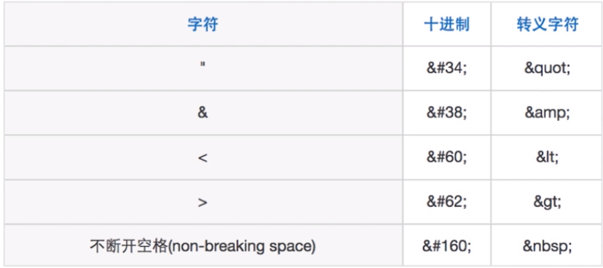

# XSS 相关知识

## XSS 攻击方式

### 反射型

> 浏览器向服务器发出请求时，XSS 代码出现在 URL 中，作为输入提交到服务器端，服务器端解析后响应，XSS 代码随响应内容一起传回浏览器，最后浏览器解析执行响应内容，XSS 代码同时也被执行。
> 这个过程像一次反射，所以称作反射型攻击。

例子：


使用 express 脚手架（express-generator）搭建一个服务器
在 views/index.ejs 页面中添加代码：

```javascript
<%- xss %> // 注意这里的写法，不是 <%= %> ，因为不能让 XSS 代码进行转义，用 = 号就会进行转义
```

在 routes/index.js 中添加代码：

```diff
router.get('/', function(req, res, next) {
  res.set('X-XSS-Protection', 0);
  res.render('index', {
    title: 'Express',
+   xss: req.query.xss
  });
});
```

在浏览器地址栏输入：

```javascript
// onerror 会自动触发
localhost:3000/?xss=
```

在页面初始加载时，就会弹出 1，当点击未加载出的图片时，会弹出 2。从而实现了简单的 XSS 攻击。

需要注意的几个点：

- 攻击代码在 URL 中
- 服务端要解析 URL 中的查询参数，并返回给页面进行渲染
- 攻击使用的标签不限于 img，也可以是 iframe，script 等
  ```javascript
  // 加载一个页面
  localhost:3000/?xss=<iframe src="//baidu.com"></iframe>

  // 执行一个 JS 脚本
  localhost:3000/?xss=<script>document.body.innerHTML='you are attacked';</script>
  ```

> 这种方法谷歌会检测出来并阻止掉整个页面，火狐可以直接生效

### 存储型

> 这种攻击方式与反射型的差别在于，存储型的攻击代码会储存在服务端（数据库、内存、文件中等），下次请求页面不用再次提交 XSS 代码

例子：
在 routes/index.js 中添加代码：

```diff
router.get('/', function(req, res, next) {
  res.set('X-XSS-Protection', 0);
  res.render('index', {
    title: 'Express',
+   xss: (sql语句等，或其他代码)
  });
});
```

## XSS 攻击的防御措施

> 防御大致思路：将用户输入的数据进行编码，然后使用的时候进行解码，解码的同时进行过滤，最后再进行校正。

### 编码

- 进行 HTML Entity（字符实体） 编码

例如：



### 过滤（最重要）

- 过滤用户上传的 DOM 节点。例如：style、script、iframe、frame、img 等
- 过滤用户上传的 DOM 属性 / 方法。例如：onerror、onclick 等

### 校正

- 避免直接对 HTML Entity 解码
- 使用 DOM Parse 转换、校正不匹配的 DOM 标签
  > 使用 DOM Parse 将文本或字符串解析成 DOM 对象，然后进行过滤

## 实战部分

