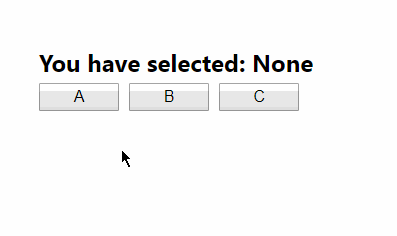

# React.children 和 React.cloneElement

官网文档：
[React.children](https://reactjs.org/docs/react-api.html#reactchildren)
[React.cloneElement](https://reactjs.org/docs/react-api.html#cloneelement)

理解 `React.children` 和 `React.cloneElement`：

```js
import React, { Component } from 'react';

class App extends Component {
  render() {
    return (
      <Button>
        <button>A</button>
        <button>B</button>
        <button>C</button>
      </Button>
    );
  }
}

class Button extends Component {
  constructor(props) {
    super(props);

    this.state = { selected: 'None' };
  }

  clickButton = selected => {
    this.setState({ selected });
  };

  render() {
    const { children } = this.props;
    const items = React.Children.map(children, child => {
      return React.cloneElement(child, {
        onClick: this.clickButton.bind(this, child.props.children)
      });
    });

    return (
      <div>
        <h2>You have selected: {this.state.selected}</h2>
        {items}
      </div>
    );
  }
}

export default App;
```

效果如下：


