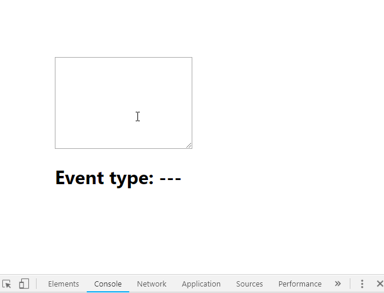

# 事件系统

当事件触发的时候，打印出事件的类型：

```js
import React, { Component } from 'react';

class App extends Component {
  constructor() {
    super();

    this.state = {
      currentEvent: `Event type: ---`
    };
    this.update = this.update.bind(this);
  }

  update(e) {
    this.setState({
      currentEvent: `Event type: ${e.type}`
    });
  }

  render() {
    return (
      <div>
        <textarea
          onKeyPress={this.update}
          onCopy={this.update}
          onCut={this.update}
          onPaste={this.update}
          onFocus={this.update}
          onBlur={this.update}
          onDoubleClick={this.update}
          // Mobile
          onTouchStart={this.update}
          onTouchMove={this.update}
          onTouchEnd={this.update}
          cols='30'
          rows='10'
        />
        <h1>{this.state.currentEvent}</h1>
      </div>
    );
  }
}

export default App;
```

实现效果如下：


