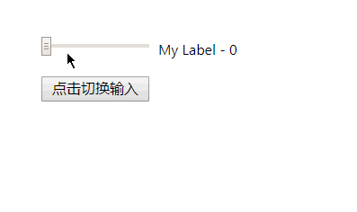

# 编写可重用的组件

通过给组件传入参数，编写可重用的组件：

```js
import React, { Component } from 'react';
import PropTypes from 'prop-types';

class App extends Component {
  constructor(props) {
    super(props);

    this.state = {
      inputValue: 0,
      inputType: 'range'
    };
  }

  update = e => {
    this.setState({
      inputValue: e.target.value
    });
  };

  toggle = () => {
    this.setState({
      inputType: this.state.inputType === 'range' ? 'number' : 'range'
    });
  };

  render() {
    return (
      <div>
        {/* 使用自定义的组件 */}
        <NumInput
          type={this.state.inputType}
          min={0}
          max={255}
          step={1}
          value={+this.state.inputValue}
          update={this.update}
          label={'My Label'}
        />
        <button onClick={this.toggle}>点击切换输入</button>
      </div>
    );
  }
}

// 可重用的组件
class NumInput extends Component {
  render() {
    const { type, min, max, step, value, update, label } = this.props;

    return (
      <div>
        <input
          type={type}
          min={min}
          max={max}
          step={step}
          defaultValue={value}
          onChange={update}
        />
        {label !== '' ? (
          <label>
            {label} - {value}
          </label>
        ) : (
          ''
        )}
      </div>
    );
  }
}

// 对参数进行类型检查
NumInput.propTypes = {
  type: PropTypes.oneOf(['number', 'range']),
  min: PropTypes.number,
  max: PropTypes.number,
  step: PropTypes.number,
  value: PropTypes.number,
  update: PropTypes.func.isRequired,
  label: PropTypes.string
};

// 默认参数值
NumInput.defaultProps = {
  type: 'range',
  min: 0,
  max: 0,
  step: 1,
  value: 0,
  label: ''
};

export default App;
```

> `React.RropTypes` 自 React v15.5 就已经弃用。使用 `prop-types` 库代替

效果如下：


