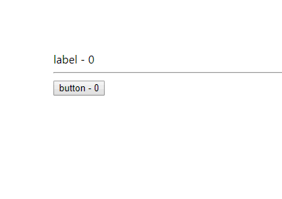

**高价组件（HOC）就是一个函数，而且是一个没有副作用的纯函数。它接收一个组件作为参数，并返回一个新的组件。**

高价组件用来重写组件逻辑。它并不是 React API，它只是一种模式。

高价组件不会修改输入组件，也不会使用继承拷贝它的行为。而是组合原始组件，通过一个容器组件包裹原始组件。

示例：

```js
import React, { Component } from "react";

// HOC: Heigher Order Component
const HOC = InnerComponent =>
  class WrapperComponent extends Component {
    constructor(props) {
      super(props);

      this.state = { count: 0 };
    }

    componentWillMount = () => {
      console.log("HOC will mount");
    };

    update = () => {
      this.setState({ count: this.state.count + 1 });
    }

    render() {
      return (
        <InnerComponent
          {...this.props}
          {...this.state}
          update={this.update}
        />
      );
    }
  };

const ButtonHOC = HOC(props => (
  <button onClick={props.update}>
    {props.children} - {props.count}
  </button>
));

class Label extends Component {
  componentWillMount = () => {
    console.log("Label will mount");
  };

  render() {
    return (
      <label
        onMouseOver={this.props.update}
      >
        {this.props.children} - {this.props.count}
      </label>
    );
  }
}

const LabelHOC = HOC(Label);

class App extends Component {
  render() {
    return (
      <div>
        <LabelHOC>label</LabelHOC>
        <hr />
        <ButtonHOC>button</ButtonHOC>
      </div>
    );
  }
}

export default App;
```

效果如下：

