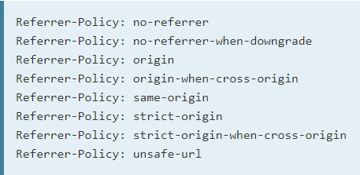

# Web 安全

## 总结

- [密码安全](https://github.com/liuyib/study-note/tree/master/Web%E5%AE%89%E5%85%A8/%E5%AF%86%E7%A0%81%E5%AE%89%E5%85%A8)
- [Cookies安全](https://github.com/liuyib/study-note/tree/master/Web%E5%AE%89%E5%85%A8/Cookies%E5%AE%89%E5%85%A8)
- [XSS](https://github.com/liuyib/study-note/tree/master/Web%E5%AE%89%E5%85%A8/XSS)

  攻击类型：

    - 反射型

      **原因：** 通过 URL 参数发送的数据（可能混入 XSS 代码），没有进行处理，直接显示在页面上。

    - 存储型

      **原因：** 接收到的数据（可能混入 XSS 代码）没有进行处理，直接保存在了服务端。

  **防御：**
  
    - 浏览器自带一小部分防御功能
    - 对数据进行转义和过滤
    - 设置 HTTP 请求头 `Content-Security-Policy` (CSP)

      示例：

      

    - 设置 HTTP 响应头 `X-XSS-Protection`

      

- [CSRF](https://github.com/liuyib/study-note/tree/master/Web%E5%AE%89%E5%85%A8/CSRF)

  攻击类型：

    - GET

      **原因：** 通过 URL 参数直接修改数据或资源，并且没有进行安全验证。

    - POST

      **原因：** 使用 `Cookies` 不合理，并且没有对数据进行安全性处理。

    - 超链接类型

      > 将 GET 类型攻击嵌入超链接中

      原因同 GET 类型攻击。

  **防御：** 

    - 同源检测

      - 检测 HTTP 请求头 `Origin`
      - 检测 HTTP 请求头 `Referer`

    - 设置 HTTP 响应头 `Referrer-Policy`

      
      
      > 设置 `Referrer-Policy` 的方式：
      >
      > - 通过 CSP 设置
      > 示例：`Content-Security-Policy: same-origin`
      >
      > - 使用 meta 标签设置
      > 示例：`<meta name="referrer" content="same-origin">`
      >
      > - a 标签添加 `referrer` 属性设置
      > 示例：`<a href="http://example.com" referrer="no-referrer|origin|unsafe-url"></a>`
      >   > 这种方式只作用于单个链接

    - 设置 HTTP 响应头 `Set-Cookie` 的 `SameSite` 属性

      示例：

      

    - 使用 `Token` 验证
    - 双重 `Cookies` 验证

- [点击劫持](https://github.com/liuyib/study-note/tree/master/Web%E5%AE%89%E5%85%A8/%E7%82%B9%E5%87%BB%E5%8A%AB%E6%8C%81)

  **原因：** 网站允许被第三方网站通过 `iframe (frame)` 内嵌。
  **防御：**
  
    - 设置 HTTP 响应头 `x-frame-options`

      
  
      > 非标准 HTTP 头

    - 设置 HTTP 响应头 CSP 的属性 `frame-ancestors`

      

    - 使用 JS 判断网站的顶层对象是否改变

      ``` js
      if (top !== self) {
        top.location = self.location;
      }
      ```

- [SQL 注入](https://github.com/liuyib/study-note/tree/master/Web%E5%AE%89%E5%85%A8/SQL%E6%B3%A8%E5%85%A5)

## 辅助工具

检测网站 HTTP 安全头的设置情况：[Security Headers](https://securityheaders.com/)
