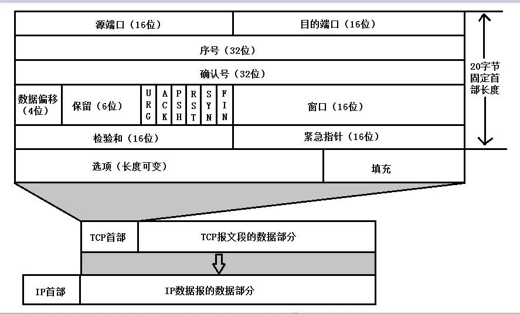
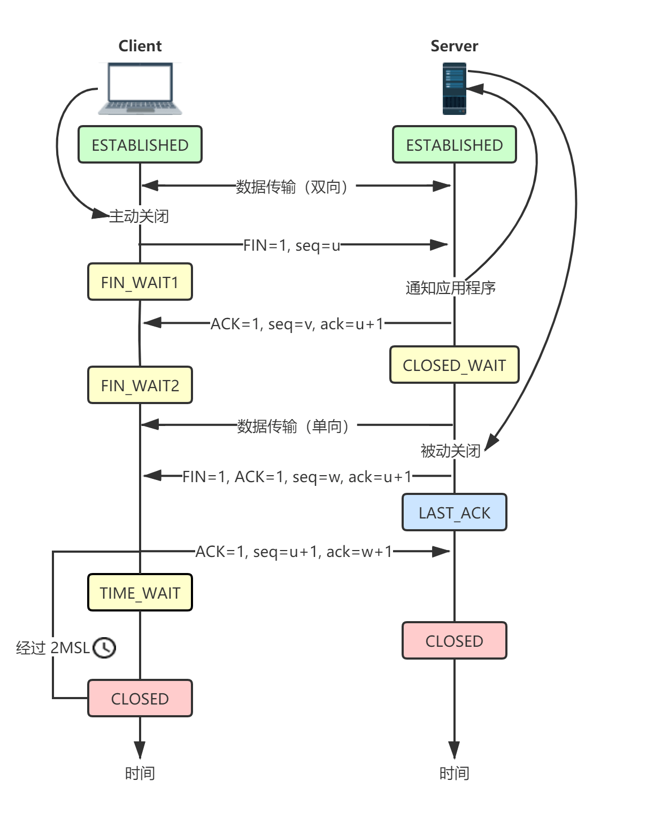

# TCP 协议

## TCP 三次握手

所谓握手，即一次发包与接收的过程，可能是从客户端到服务端，也可能是从服务端到客户端。

进行三次握手的目的是：1、确认双方的接收能力和发送能力。2、同步连接双方的序列号和确认号。3、交换 TCP 窗口大小信息。

首先了解一下 TCP 报文的结构，如图所示：

有几个字段需要重点介绍下：

- 序号（seq）：用来表示发送的字节流（由发起方进行标记）
- 确认号（ack）：只有 ACK 标志位为 1 时，确认号才有效
- 标志位

  - `ACK`：表示确认号有效
  - `SYN`：表示发起一个新连接
  - `FIN`：表示释放一个新连接
  - `RST`：表示重置连接

刚开始客户端处于 Closed 的状态，服务端处于 Listen 状态。进行三次 TCP 握手过程如下：

- 第一次握手

  客户端给服务端发送一个 SYN 报文，其中指定同步位 `SYN = 1`，初始序号 `seq = x`，此时客户端处于 `SYN_SENT` 状态。

  > `SYN = 1` 的报文段不能携带数据，但是要消耗掉一个序号。

- 第二次握手

  服务端应答一个 SYN 报文，其中指定同步位 `SYN = 1`，确认位 `ACK = 1`，确认号 `ack = x + 1`（客户端发来的序号 + 1），序号 `seq = y`，此时服务端处于 `SYN_REVD` 状态。

- 第三次握手

  客户端应答一个 ACK 报文，其中指定确认位 `ACK = 1`，确认号 `ack = y + 1`（服务端发来的序号 + 1），序号 `seq = x + 1`（客户端初始序号 = x），此时客户端处于 `ESTABLISHED` 状态。当服务器收到 ACK 报文后，也处于 `ESTABLISHED` 状态。这时，双方就建立起了连接。

  > ACK 报文段可以携带数据，不携带数据则不消耗序号。

以上就是 TCP 三次握手的过程，如图所示：

## 一些问题（三次握手相关）

### 为什么三次握手，两次可以吗？

简单来说，三次握手的目的是**验证双方的发送能力和接收能力**，如下：

- 第一次握手，客户端发送，服务端接收。证明服务端知道了客户端的发送能力没问题。
- 第二次握手，服务端发送，客户端接收。证明客户端知道了服务端的发送、接收能力都没问题。

  > 到这为止，如果只是两次握手，服务端并不知道客户端的的接收能力是否正常（因为客户端没有接收数据再发送给服务端）。

- 第三次握手，客户端发送，服务端接收。这一次，客户端是接收到数据再发送给服务端的，所以服务端知道了客户端的接收能力没问题。

### 如果采用两次握手，会导致什么问题？

如果 A 发送了一个 SYN 报文段，但是由于某种原因，在网络上滞留了很长时间，导致连接超时并释放后的某个时间点才到达 B。此时 B 以为是 A 新发起的连接，于是向 A 发送确认报文。

由于 A 并没有新发起连接（之前的连接已经超时释放了），所以不会理睬 B 的确认请求，但是 B 会一直等待 A 发来数据，因此使得 B 白白浪费了很多资源。

总的来说，三次握手的目的是 **“为了防止已经过期的连接请求，又到达了服务端而产生错误”**。

### 两端同时发起请求时会怎样？建立几个连接？

如题，两端都会扮演发起者和接收者的角色，它们的状态分别如下：

依次经历 `CLOSED` -> `SYN_SENT` -> `SYN_REVD` -> `ESTABLISHED`。最终只会建立起一个连接。

### 当服务器状态变为 SYN_REVD 时，又收到了一个旧的 SYN 报文，该怎么处理？

服务端在 SYN_REVD 状态下，接收到旧的 SYN 报文时是不能作出判断的，而是照常返回，当客户端接收到该报文后发现异常，会发送 RST 报文，来重置连接。

### 报文丢失导致握手失败会怎样？

该情况如下图所示：

当客户端收到服务端的确认报文后，状态变为 ESTABLISHED，然后发送 ACK 报文给服务端。如果 ACK 报文没有到达服务端，则会进行超时重传。当超过了重传次数，服务端还是没有收到 ACK 报文，会直接断开连接。

问题就在于，客户端认为连接已经建立，而服务端可能处于 SYN_REVD 或 CLOSED 状态。接下来根据服务端的两种状态来考虑：

- **服务端处于 CLOSED 状态**

  如果服务端收到“确认连接关闭的报文”，那么会返回 RST 报文，客户端收到 RST 报文会重置连接。

- **服务端处于 SYN_REVD 状态**

  1、如果接收到正常的 ACK 报文，那么直接恢复连接。2、如果接收到携带数据的请求（携带数据的请求也是 ACK 报文），同样也会恢复连接，然后变为 ESTABLISHED 状态，继续传输数据。

总结来说：**如果 ACK 报文丢失了，下一个报文没有丢失，则连接正常，否则连接会被重置**。

### 知道 SYN 洪泛攻击吗？如何防范？

所谓 SYN 洪泛攻击，就是通过发起大量的 TCP 连接请求，耗尽服务器的资源。这也是一种典型的 DDoS 攻击。

原理如下：建立 TCP 连接时，服务器会为请求分配缓存。因此，攻击者会使用大量的虚假 IP 向服务器发起 TCP 连接请求。服务器响应这些请求，但是得不到回复（因为都是假 IP），因此只能重复请求，直到超时才关闭连接。最终，服务器不断为连接分配资源，导致资源被耗尽。

防范措施：**SYN Cookie 防御**。

SYN Cookie 防御的原理：服务端收到 SYN 报文后，暂时不分配缓存。而是使用**源 IP 地址**、**目的 IP 地址**、**端口**和**服务端存储的一个秘密数**进行 Hash，得到 server_isn，然后随着确认报文发给客户端。下次收到客户端的确认报文时，判断确认号（ack 字段）是否等于 `server_isn + 1`。如果是，则证明是一个合法的 ACK 报文，连接建立。否则，关闭连接。

SYN Cookie 防御的缺点：由于服务端不保存**连接的半开状态**，因此丧失了重发确认报文的能力。一方面使得连接的成功率降低，另一方面使得通信双方对连接是否公共产生误解（例如：客户端发送的第三次握手的 ACK 报文丢失了，而客户端认为连接成功了，但是服务端没收到 ACK 报文，认为没有连接成功。解决措施是上层应用采取一定的措施进行处理）。

### 三次握手可以携带数据吗？

前面也提到，SYN 报文不能携带数据，ACK 报文可以。因此三次握手中，只有**第三次**握手可以携带数据。

## TCP 四次挥手

断开 TCP 连接需要发送四次包，因此称为四次挥手。客户端或服务端均可主动发起挥手动作。

一次连接需要三次握手，但是挥手却需要四次，这是由于 TCP 的半关闭状态造成的。所谓半关闭状态，就是连接的一端在结束发送后，还能再接收数据的状态。

刚开始，双方都处于 ESTABLISHED 状态，**假如客户端先发起关闭请求**。则挥手过程如下：

- 第一次挥手

  客户端发送一个 FIN 报文（连接释放报文），其中指定终止位 `FIN = 1`，序号 `seq = u`。此时客户端处于 `FIN_WAIT1` 状态（终止等待 1 状态），并停止发送数据，等待服务器确认。

- 第二次挥手

  服务端回应一个 ACK 报文（确认报文），其中指定确认位 `ACK = 1`，确认号 `ack = u + 1`，序号 `seq = v`。此时服务端处于 `CLOSE_WAIT` 状态（关闭等待状态），此时 TCP 连接处于半关闭状态（客户端的连接释放，并得到了服务端的确认；服务端还没释放连接）。

  客户端收到服务端的确认报文后，进入 `FIN_WAIT2` 状态（终止等待 2 状态），等待服务端发出连接释放报文。

- 第三次挥手

  服务端发送一个 FIN 报文（连接释放报文），其中终止位 `FIN = 1`，确认位 `ACK = 1`，确认号 `ack = u + 1`，序号 `seq = w`。服务端处于 `LAST_ACK` 状态（最后确认状态），等待客户端的确认。

- 第四次挥手

  客户端回应一个 ACK 报文（确认报文），其中指定确认位 `ACK = 1`，确认号 `ack = w + 1`，序号，序号 `seq = u + 1`。此时客户端处于 `TIME_WAIT` 状态（时间等待状态），客户端并不会立即处于 CLOSED 状态，而是经过计时器设置的 2MSL 时间后才变为 CLOSED 状态。然后，服务端收到 ACK 报文后，会立即关闭连接，变为 CLOSED 状态。

以上就是 TCP 四次挥手的过程，如图所示：

> 其中，MSL（Maximum Segment Lifetime，报文段最大生存时间）表示报文段被丢弃前，在网络上的最长时间。

## 一些问题（四次挥手相关）

### 为什么三次握手，而挥手是四次？

1. 建立连接时，当服务端收到客户端的 SYN 报文后，可以直接回应 **SYN-ACK 报文**。其中 ACK 是用来应答的，SYN 是用来同步的。

2. 关闭连接时，当服务端收到 FIN 报文时，很可能还在发送/接收报文，不能立即关闭连接，所以只能先回复一个 ACK 报文（用于告诉服务端“你发送的 FIN 报文我收到了”）。只有等到服务端将所有报文都发送/接收完了，才能发送 FIN 报文。

### 四次挥手时，等待 2MSL 的意义？

1. **为了确保客户端回应的最后一个 ACK 报文能够到达服务端**。

   我们必须假设网络是不可靠的，客户端最后发送的 ACK 报文可能丢失。如果服务端发送 FIN 而没有收到 ACK 报文，就会重发 FIN 报文。此时客户端会重新确认，再次发送 ACK 报文。

   当然，客户端需要假设服务端会再次发送 FIN 报文，但又不能一直等待下去。因此，需要设定一个等待时间，这个时间设置为 2MSL 最为合适。

2. **防止已失效的连接的 SYN 报文，出现在新的连接中**。

   客户端发送完最后一个 ACK 报文后，再等待 2MSL 时间，就可以使滞留在网络上的报文失效。从而使得下一次新的连接中不会再出现旧连接的报文。

---

参考资料：

- [阿里面试： HTTP、HTTPS、TCP/IP、三次握手四次挥手过程？](https://zhuanlan.zhihu.com/p/103000747)
- [面试官，不要再问我三次握手和四次挥手](https://juejin.im/post/5d9c284b518825095879e7a5)
