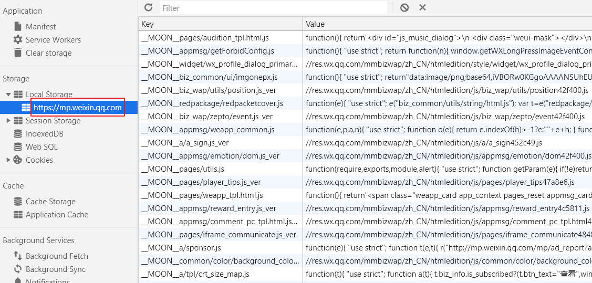

目前浏览器中常用的存储方式有以下几种：

- Cookie
- Local Storage
- Session Storage
- IndexedDB
- Service Worker
- WebSQL (被废弃)

## Cookie

1）Cookie 来源

由于 **HTTP 协议是无状态的协议，协议本身不保存通信中的任何状态**。因此，这个特点影响了 Web 应用的交互体验。例如：用户在一个网站登录后，在站内的链接之间跳转，但由于 HTTP 协议的无状态特性，无法记住用户的登录状态，所以跳转后用户仍是未登录状态。

为了解决 HTTP 无状态特性带来的一些问题，引入了 Cookie 来记录通信时的一些状态。

2）Cookie 定义

Cookie 是服务器发送到用户浏览器并保存在本地的一段文本信息，它会在浏览器之后向服务器发送请求时，自动被携带上。

3）Cookie 作用

Cookie 主要用来**分辨两个请求是否来自同一个浏览器**，以及保存一些状态信息。

其常用的应用场景有以下三个方面：

- 会话状态管理（如记录登录态、购物车、游戏分数等信息）
- 个性化设置（如记录用户的偏好设置、主题等）
- 浏览器行为跟踪（如记录和分析用户行为等）

> Cookie 的本职工作并不是用于存储数据，但是由于最初浏览器存储技术缺乏，Cookie 一度被开发者用于存储客户端数据。

4）Cookie 相关属性

- Name=Value

  用于指定 Cookie 的名称和对应的值，字符串类型。

  > - 如果值为 Unicode 字符，会进行 URL 编码
  > - 如果值为二进制数据，则需要使用 Base64 编码

- Domain

  用于指定 Cookie 对于哪个域生效（对子域名也生效）。

  > 如果不指定，默认为“当前 URL 的主域名”。例如：`www.example.com` 会设为 `example.com`。

- Path

  用于指定 Cookie 对于哪个路径生效（对子路径也生效）。

  > 如果不指定，默认为 `/`。

- Expires / Max-Age

  `Expires`：用于指定 Cookie 的到期时间。值为 UTC 格式

  `Max-Age`：用于指定 Cookie 从现在开始存在的**秒**数

  两者同时存在时，`Max-Age` 优先生效

  > 如果 `Set-Cookie` 没有指定 `Expires / Max-Age` 属性，也就是没有设置过期时间，则 Cookie 只存在于本次会话中（关闭浏览器后 Cookie 就会被删除）。

- HttpOnly

  用于指定 Cookie 无法通过 JavaScript 脚本获取，只会在浏览器发送 HTTP 请求时携带。

  > 用于防止 XSS 攻击。

- Secure

  用于指定浏览器，只有在 HTTPS 协议下，才会在发送请求时携带 Cookie。

  > 即便设置了 `Secure` 标记，敏感信息也不要使用 Cookie 传递。

- SameSite

  用于指定某个 Cookie 在跨域请求时不会被发送。

  > 用于防止 CSRF 攻击。

  有三个可选值：

  - **`Strict`**

    最为严格，完全禁用第三方 Cookie，只有同源时才发送。设置示例：

    ```http
    Set-Cookie: name=liuyib; SameSite=Strict;
    ```

    缺点：规则过于严格，使得用户体验不好（用户点击链接跳转时，总是未登录状态）。

  - **`Lax`**

    稍微宽松，大多数情况下不发送第三方 Cookie，导航到目标网址的 GET 请求除外。设置示例：

    ```http
    Set-Cookie: name=liuyib; SameSite=Lax;
    ```

    使用该规则时，只有三种情况会发送第三方 Cookie：**“链接，预加载请求，GET 表单”**。详见下表：

    |请求方式|示例|正常情况|Lax|
    |:---|:---|:---|:---|
    |链接|`<a href="..."></a>`|发送 Cookie|发送 Cookie|
    |预加载|`<link rel="prerender" href="..."/>`|发送 Cookie|发送 Cookie|
    |GET 表单|`<form method="GET" action="...">`|发送 Cookie|发送 Cookie|
    |POST 表单|`<form method="POST" action="...">`|发送 Cookie|不发送|
    |`iframe`|`<iframe src="..."></iframe>`|发送 Cookie|不发送|
    |Ajax|`$.get("...")`|发送 Cookie|不发送|
    |Image|``|发送 Cookie|不发送|

  - **`None`**

    始终发送第三方 Cookie，不区分大小写。

  对于 `SameSite` 属性，在旧版浏览器中，如果**没有设置**或者**浏览器不支持**，则默认值为 `None`。

  但是，在 Chrome 80+ 版本中，`SameSite` 的默认值为 `Lax`。此时，如果想关闭该属性，**需要显示设为 `None`，并同时设置 `Secure` 属性，否则无效**。

5）Cookie 的使用

Cookie 的大小一般不超过 4KB。

服务器需要通过响应头 `Set-Cookie`，向客户端设置 Cookie。例如：

```http
Set-Cookie: name=liuyib; expires=Wed, 05-May-2020 15:22:43 GMT; path=/; domain=example.com;
```

当然，Cookie 也可以通过 JS 脚本来操作，通过 `document.cookie` 这个 API。例如：

```js
document.cookie = "name=文一; Max-Age=3600; path=/; domain=*.example.com"; 
document.cookie = "age=22"; 

console.log(document.cookie);
// => "name=文一; age=22"
```

**手动**删除 Cookie 的唯一方法是：**将其 `expires` 属性设置为一个过去的日期**。例如：

```js
document.cookie = `name=文一;expires=${new Date('1970').toGMTString()}`;
```

## Web Storage

Cookie 的设计初衷并不是用于存储大量数据（也不适合）。因此，为了解决数据存储问题，在 HTML5 中新增了 Web Storage 方案，其分为两类 `localStorage` 和 `sessionStorage`。

### Web Storage 对比

|性质|`localStorage`|`sessionStorage`|
|:---:|:---:|:---:|
|存储时间|永久存储|会话存储|
|存储大小|~5MB|~5MB|
|数据类型|String|String|
|作用范围|同源（协议+域名+端口）|浏览器 Tab 页|

除了以上性质，**sessionStorage** 的特性如下：

- 不同的 Tab 页面，会创建各自的 `sessionStorage`（即使 URL 相同）
- 关闭浏览器 Tab 页，会清除对应的 `sessionStorage` 数据
- 页面**重新加载**或**关闭后恢复**，`sessionStorage` 仍然有效

> 需要注意一点：**恢复页面**是指你将页面关闭后，通过快捷键 `Ctrl + Shift + t` 将原先的页面恢复，而你新打开一个 Tab 页，输入原来的地址并不算恢复页面。

### Web Storage 的 API 介绍

`localStorage` 和 `sessionStorage` 具有相同的 API，如下所示：

|操作|用法|
|:---:|:---|
|设置|`localStorage.setItem('name', '文一');` <br> `sessionStorage.setItem('name', '文一');` <br> `// 也可以使用以下形式` <br> `localStorage.name = '文一';` <br> `localStorage['name'] = '文一';` |
|获取|`localStorage.getItem('name');` <br> `sessionStorage.getItem('name');` <br> |
|删除|`localStorage.removeItem('name');` <br> `sessionStorage.removeItem('name');` <br> |
|清空|`localStorage.clear();` <br> `sessionStorage.clear();` <br> |

### Web Storage 应用场景

1）**`localStorage`**

由于 `localStorage` 具有持久存储的性质，因此**适用于存储一些较为稳定的静态资源**。

举个例子：VX 小程序的文章页面，之所以能够实现秒开，就是将大部分静态资源存储到了 `localStorage` 中。如图所示：



2）**`sessionStorage`**

由于 `sessionStorage` 具有会话存储的性质，因此**适用于临时的数据维持**。

举个例子：当用户填写表单时，可以用 `sessionStorage` 暂存数据。此时，即使用户错误的关闭了浏览器（或 Tab 页），甚至是断电，只要用户在浏览器中按下快捷键 `Ctrl + Shift + t`（或在浏览器工具栏右键，选择“重新打开关闭的标签页(E)”），就可以恢复之前填写的表单数据，极大的提高了用户体验。

## IndexedDB


## Service Worker

## 简单的对比

|特性|Cookies|Local Storage|Session Storage|IndexedDB|
|---|---|---|---|---|
|存储限制|~4KB|~5MB|~5MB|取决于硬盘大小|
|持久性？|Yes|Yes|No|Yes|
|数据类型|String|String|String|Any|
|可索引？|No|No|No|Yes|

---

参考资料：

- [HTTP cookies | MDN](https://developer.mozilla.org/zh-CN/docs/Web/HTTP/Cookies)
- [当浏览器全面禁用三方 Cookie](https://juejin.im/post/5e97124df265da47b27d97ff)
- [Cookie 的 SameSite 属性](https://www.ruanyifeng.com/blog/2019/09/cookie-samesite.html)
- [傻傻分不清之 Cookie、Session、Token、JWT](https://juejin.im/post/5e055d9ef265da33997a42cc)
