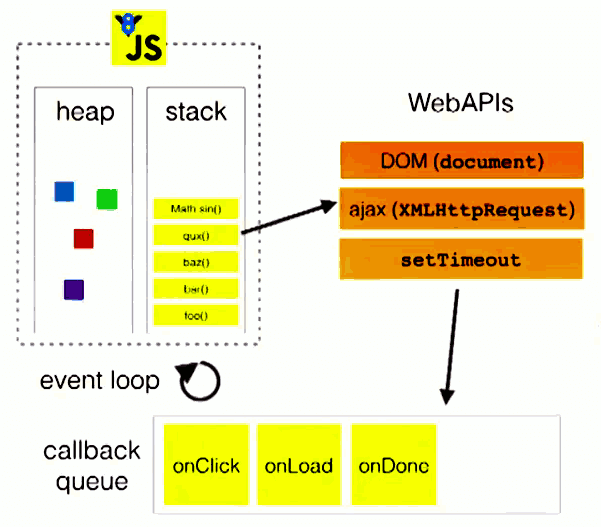
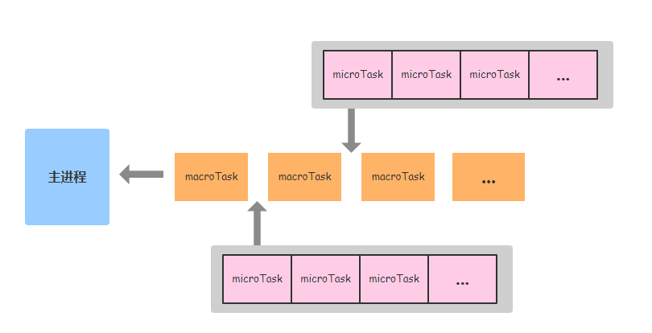
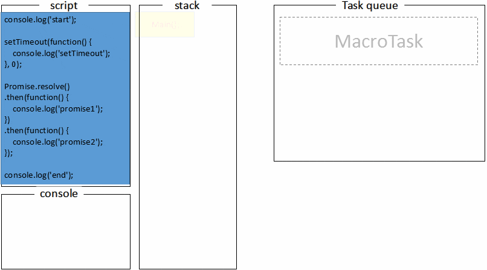

[相关标准规范文档](https://html.spec.whatwg.org/multipage/webappapis.html#event-loop-processing-model)

# 深入理解 JS 事件循环机制（浏览器篇）

众所周知，JavaScript 是一门**单线程**的**非阻塞**的语言，这是由于其最初的用途“与浏览器交互”决定的。

**单线程**：JavaScript 代码在执行的时候，只有一个主线程来处理任务。

尽管后来 HTML5 中加入了 Web Worker 标准，允许 JavaScript 创建多个子线程，但是子线程完全受主线程控制、无法操作 DOM、主线程可以随时终止子线程 等。所以，仍然没有改变 JavaScript 是单线程的本质。

**非阻塞**：JavaScript 代码执行时，如果遇到异步任务，并不会立即执行，而是将其加入“任务队列”（task queue），直到条件允许时，再被主线程调用。

## 单线程和异步

单线程实现异步，其背后的原理就是本文的重点“事件循环”（Event Loop）。

JavaScript 中的任务分为两种：**同步任务**和**异步任务**。它们的处理方式分别如下：

- **同步任务**：直接将同步任务在主线程上排队执行
- **异步任务**：先将异步任务加入“**任务队列**”，等条件合适时，再移到**调用栈（call stack）**，然后被主线程调用

由异步任务的处理方式就可以看出，它不会造成主线程阻塞。例如，发送一个 Ajax 请求后，浏览器会继续做其他的任务，响应回来后，其对应的回调函数被添加到任务队列中等待执行，因此，并没有阻塞主线程。

### 事件循环机制

函数调用时，会形成一个栈帧，栈帧中包含了当前函数的参数和局部变量等**上下文信息**。函数执行完毕后，它的上下文会从调用栈中弹出。

**事件循环**（Event Loop）过程：JavaScript 主线程在执行时，从“任务队列”中读取事件，然后放入“调用栈”来执行，整个过程不断循环。

调用栈和任务队列的关系如下图所示：



> 图片来源：http://vimeo.com/96425312

## 宏任务和微任务

现在我们知道了，JavaScript 遇到异步任务时，会将其加入任务队列来等待执行。

其实，不同异步任务的处理方式并不完全相同，根据执行时机可分为**宏任务**（macrotask）和**微任务**（microtask）。

它们具体的分类如下：

- **宏任务**：定时器（`setTimeout`/`setInterval`/`setImmediate（Node.js）`）、`MessageChannel`、事件回调、I/O（文件、网络）操作、UI 渲染
- **微任务**：`Promise 的 .then, .catch, .finally`、`await 之后的代码`、`MutationObserver`、`Process.nextTick（Node.js）`、`Object.observe（废弃）`

> 注意：`Promise` 构造函数里的代码，属于同步任务。

相应地，任务队列可以分为**微任务队列**和**宏任务队列**，它们的执行顺序如下图所示：



> 图片来源：http://lynnelv.github.io/js-event-loop-browser

由图可知，一次 Event Loop 的具体过程如下：

1. 首先，检查宏任务队列。不为空就执行其中**一个**宏任务；为空就去检查微任务队列。
2. 检查微任务队列。不为空就执行其中一个微任务，然后再检查微任务队列，直到把微任务队列清空。
3. 如果可以更新视图，则进行更新，否则进行下一次 Event Loop。

下面我们通过一个具体的示例来加深理解：

```js
console.log('start');

// setTimeout 属于宏任务
setTimeout(function () {
  console.log('setTimeout');
}, 0);

Promise.resolve()
  .then(function () {
    // Promise 回调属于微任务
    console.log('promise1');
  })
  .then(function () {
    // Promise 回调属于微任务
    console.log('promise2');
  });

console.log('end');
```

执行过程如下图所示：



> 图片来源：http://lynnelv.github.io/js-event-loop-browser

首先，全局代码（`Main()`）入栈，打印 start。

然后，遇到 `setTimeout`，将其加入宏任务队列，代码继续向下执行。

遇到 `Promise`，将其回调加入微任务队列，代码继续向下执行。

打印 end。此时，全局代码执行结束，`Main()` 出栈。由于全局代码（`Main()`）属于宏任务，所以根据 Event Loop 执行过程可知，执行完**一个**宏任务后，会去检查微任务队列。

然后，**清空微任务队列**和**执行一个宏任务**依次交替进行，直到所有任务执行完毕。

## 视图渲染

回顾上文中的 Event Loop，视图渲染（update rendering）可能会发生在微任务队列清空后，但是是否更新，由浏览器决定。

我们知道，现代浏览器通常以 60 FPS 来刷新页面，也就是大约 16.7ms 渲染一帧。而视图渲染需要在一次 Event Loop 之后进行，所以任务队列中事件的执行时间，影响了页面的渲染帧率。

为了让页面流畅渲染，**一个宏任务**和**它相关的微任务**（也就是一次 Event Loop）最好能再 16.7ms 内完成。否则，一帧中没有多余的时间来更新视图，只能放到下一帧再更新，从而造成了**丢帧**。

但也不是每轮 Event Loop 都会更新视图。比如，有可能好几轮 Event Loop 的总耗时还未大于 16.7ms。因此，如果每帧都进行视图渲染，则会比较浪费资源。所以，可以使用 `requestAnimationFrame` 来进行优化，确保每帧只进行一次视图渲染。也就是说 `requestAnimationFrame` 的执行时机是一次或多次 Event Loop 后的 UI 渲染阶段。

以下代码可以验证：

```js
console.log('start');

setTimeout(function () {
  console.log('timer1');
}, 0);

requestAnimationFrame(function () {
  console.log('requestAnimationFrame');
});

setTimeout(function () {
  console.log('timer2');
}, 0);

Promise.resolve().then(function () {
  console.log('promise1');
});

console.log('end');
```

执行结果如下：

```js
start;
end;
promise1;
requestAnimationFrame; // 一次 Event Loop 后执行
timer1;
timer2;

// 或者

start;
end;
promise1;
timer1;
timer2;
requestAnimationFrame; // 多次 Event Loop 后执行
```

总的来说，浏览器只保证 `requestAnimationFrame` 的回调在重绘之前执行，没有确定的时间，何时重绘由浏览器决定。

---

- [详解 JavaScript 中的 Event Loop（事件循环）机制](https://zhuanlan.zhihu.com/p/33058983)
- [JavaScript 运行机制详解：再谈 Event Loop](http://www.ruanyifeng.com/blog/2014/10/event-loop.html)
- [深入理解 js 事件循环机制（浏览器篇）](http://lynnelv.github.io/js-event-loop-browser)
