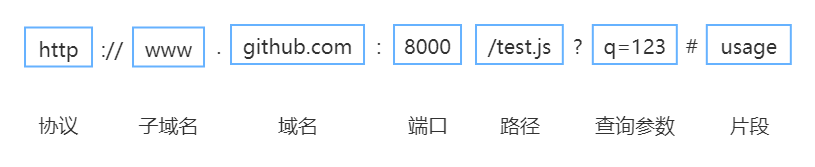

常见的跨域方法及其实现原理。

## 为什么会跨域

浏览器为了保证内容的安全，采取了同源策略，从而尽可能的减少 XSS、CSRF 攻击。因此只要违背了同源策略，就会产生跨域问题。

所谓同源，是指**协议、域名、端口**都相同，即便两个不同的域名指向同一个 IP，也非同源。

同源策略限制的内容有：

- Cookie、LocalStorage 等存储的内容
- DOM 节点
- Ajax 请求发送后，返回的结果

但是有三种标签允许跨域资源加载：

- ``
- `<link href="xxx">`
- `<script src="xxx"></script>`

## 常见的跨域场景

一个 URL 的结构如下所示：



当**协议、域名、子域名、端口号**中，任意一个不同时，都算作不同域。不同域之间请求数据时，就会产生“跨域”。

常见的跨域场景举例：

|URL|说明|是否允许通讯|
|:---|:---:|:---:|
|`http://a.com/a.js` <br> `http://a.com/dist/b.js`|同一域名，不同路径|允许|
|`http://a.com:80/a.js` <br> `http://a.com:81/a.js`|同一域名，不同端口|不允许|
|`http://a.com/a.js` <br> `https://a.com/a.js`|同一域名，不同协议|不允许|
|`http://www.a.com/a.js` <br> `http://xx.xx.xx.xx/a.js`|域名和域名对应的 IP|不允许|
|`http://a.com/a.js` <br> `http://www.a.com/a.js` <br> `http://blog.a.com/a.js`|主域相同，子域不同|不允许|
|`http://www.a.com/a.js` <br> `http://www.b.com/a.js`|不同域名|不允许|

需要特别注意的一点：**如果是协议和端口造成的跨域问题，前端是无能为力的**。

或许你有个疑问，**请求跨域的时候，请求发出去了没有？**

**跨域的时候，请求可以发出去，服务端也可以接收请求并返回响应，只是结果被浏览器拦截了**。

## 跨域解决方案

目前常用的跨域方案有以下几种：

1. JSONP
2. CORS
3. `postMessage`
4. WebSocket
5. Node.js 中间件代理（两次跨域）
6. Nginx 反向代理
7. `window.name` + `<iframe>`
8. `location.hash` + `<iframe>`
9. `document.domain` + `<iframe>`

### JSONP

JSONP 的原理很简单，就是**利用 `<script>` 标签不受同源策略限制的性质，从而实现跨域请求**。不过 JSONP 请求需要对方的服务器做支持才可以。

1）JSONP 的实现

> 推荐大家跟着文章，敲一敲代码来加深理解 。

前端代码（简单版）：

```html
// index.html

<script>
  // 提前声明好回调函数
  window.show = function (res) {
    console.log(res)
  }
</script>
<script src='http://localhost:8080/jsonp?msg=hello&callback=show'></script>
```

其中，利用 `<script>` 请求 `http://localhost:8080/jsonp` 接口，并携带 `msg` 和 `callback` 参数。`msg` 参数用于携带数据（`hello`），`callback` 参数用于传递回调函数（`show`）。

然后，我们利用 Express 框架搭建一个简易的后端服务器：

```js
// server.js

const express = require('express');
const app = express();

app.get('/jsonp', function (req, res) {
  const { msg, callback } = req.query;

  console.log(msg);      // hello
  console.log(callback); // show

  // 把数据和回调函数拼接成字符串，返回给前端
  // => show('world')
  res.send(`${callback}('world')`);
  res.end();
});

app.listen(8080);
```

启动后端服务器，执行指令：

```bash
$ node server.js
```

在浏览器里运行 `index.html` 文件，可以看到控制台输出了 `world` 信息。整个过程如下：

1. 后端将**要发送的数据**和**回调函数**拼接成字符串，返回给前端。
2. 前端请求 `http://localhost:8080/jsonp?msg=hello&callback=show`，接收到的是 `show('world')`。
3. 我们都知道 `<script>` 加载完资源后，会执行其中的内容，因此接收到的 `show('world')` 会被执行。

为了方便使用，我们封装一下前端的代码：

```html
// index.html

<script>
function jsonp({ url, params, callback }) {
  return new Promise((resolve, reject) => {
    let script = document.createElement('script');
    let param = { ...params, callback };
    let arrs = [];

    for (let key in param) {
      arrs.push(`${key}=${param[key]}`)
    }

    script.src = `${url}?${arrs.join('&')}`;
    document.body.appendChild(script);

    window[callback] = function(data) {
      document.body.removeChild(script);
      resolve(data);
    }
  });
}

jsonp({
  url: 'http://localhost:8080/jsonp',
  params: { name: '文一', age: '22' },
  callback: 'show'
}).then(data => {
  console.log(data);
});
</script>
```

2）JSONP 的优缺点

JSONP 方案的优点是**兼容性好**，缺点是**仅支持 GET 方法，并且可能会遭到 XSS 攻击**。

### CORS

CORS 是 W3C 标准，全称“跨域资源共享”，它使用额外的 HTTP 标头来告诉浏览器，是否允许访问不同源的资源。

1）CORS 请求类型

CORS 请求有两种：1、**简单请求**。前端无须设置，服务端设置 `Access-Control-Allow-Origin` 即可。2、**复杂请求**。携带 Cookie，前后端都需要设置。

因此，实现 CORS 跨域通信的关键是服务器。

1.1）简单请求

只要同时满足以下两个条件，就属于简单请求：

1. 请求方法是 `HEAD`、`GET`、`POST` 之一
2. HTTP 请求头不超出以下几种字段（简单请求头）
    - `Accept`
    - `Accept-Language`
    - `Content-Language`
    - `Content-Type` 只限于以下三个值
      - `text/plain`
      - `multipart/form-data`
      - `application/x-www-form-urlencoded`
    - `DPR`、`Download`、`Save-Data`、`Viewport-Width`、`Width`
3. 请求中的任意 `XMLHttpRequestUpload` 对象均没有注册任何事件监听器，且可以使用 `XMLHttpRequest.upload` 属性访问
4. 请求中没有使用 [`ReadableStream`](https://developer.mozilla.org/en-US/docs/Web/API/ReadableStream) 对象

> 这些条件是为了兼容表单（`form`），因为历史上表单一直可以发送跨域请求。所以 Ajax 在设计时，只要表单可以发，Ajax 就可以直接发。

对于简单请求，浏览器会直接发送 CORS 请求，并在请求头中添加 `Origin` 字段，用于标识请求来自哪个**源（协议 + 域名 + 端口）**。

服务器检查 `Origin` 后，如果不允许，则返回正常的 HTTP 响应；如果允许，则返回带有 CORS 相关标头的 HTTP 响应。浏览器只有接收到后者并验证通过后，才允许访问跨域资源，否则直接阻止。

1.2）复杂请求

不符合以上条件的，就属于复杂请求。

复杂请求会在正式通信之前，进行一次“预检请求”（使用 HTTP 的 `OPTIONS` 方法）。预检请求的目的，说白了就是“正式请求要使用的方法、请求头稍微有些特殊，需要确认服务器支不支持”。

除了 `Origin`，预检请求中包含的 CORS 请求头有：

- [`Access-Control-Request-Method`](https://developer.mozilla.org/en-US/docs/Web/HTTP/Headers/Access-Control-Request-Method)

  用于告诉服务器，正式请求要使用的 HTTP 方法。

- [`Access-Control-Request-Headers`](https://developer.mozilla.org/en-US/docs/Web/HTTP/Headers/Access-Control-Request-Headers)

  用于告诉服务器，正式请求要使用的 HTTP 请求头。

> 这些请求头不需要用户设置，在发送预检请求时，浏览器会自动带上。

服务端需要设置的 CORS 响应头有：

- [`Access-Control-Allow-Origin`](https://developer.mozilla.org/en-US/docs/Web/HTTP/Headers/Access-Control-Allow-Origin)（必须）

  其值为 `*` 或 `Origin` 标头的值，表示接受哪个域的请求。

- [`Access-Control-Allow-Credentials`](https://developer.mozilla.org/en-US/docs/Web/HTTP/Headers/Access-Control-Allow-Credentials)（可选）

  其值为布尔值，表示是否允许发送 Cookie。

- [`Access-Control-Max-Age`](https://developer.mozilla.org/en-US/docs/Web/HTTP/Headers/Access-Control-Max-Age)（可选）

  表示预检请求的结果能被缓存多久，单位是秒。

- [`Access-Control-Allow-Methods`](https://developer.mozilla.org/en-US/docs/Web/HTTP/Headers/Access-Control-Allow-Methods)（可选）

  表示浏览器可以使用请求方法。

- [`Access-Control-Expose-Headers`](https://developer.mozilla.org/en-US/docs/Web/HTTP/Headers/Access-Control-Expose-Headers)（可选）

  在跨域访问时，`XMLHttpRequest` 对象的 `getResponseHeader()` 方法，只能获取到以下 7 个 HTTP 标头：

  - `Cache-Control`
  - `Content-Language`
  - `Content-Length`
  - `Content-Type`
  - `Expires`
  - `Last-Modified`
  - `Pragma`

  想要拿到更多的 HTTP 标头，需要用 `Access-Control-Expose-Headers` 来指定。

2）CORS 配置示例

**前端设置**

- 原生 Ajax

  ```js
  // 前端发送请求时，是否携带 Cookie
  xhr.withCredentials = true;
  ```

- Axios

  ```js
  // 前端发送请求时，是否携带 Cookie
  axios.defaults.withCredentials = true
  ```

- Vue

  ```js
  // 前端发送请求时，是否携带 Cookie
  Vue.http.options.credentials = true
  ```

**后端设置**

> 以 Node.js 作为举例。

```js
// 允许访问的源
res.setHeader('Access-Control-Allow-Origin', 'http://www.domain1.com');
// 允许携带的 HTTP 头
res.setHeader('Access-Control-Allow-Headers', 'X-Custom-Header');
// 允许访问的方法
res.setHeader('Access-Control-Allow-Methods', 'PUT,DELETE');
// 允许前端请求携带 Cookie
// 启用此项后，上面的源不能设置为 "*"，必须指定具体的域
res.setHeader('Access-Control-Allow-Credentials', true);
```

### postMessage

`postMessage` 是 HTML5 的 API，可用于解决以下方面的问题：

- 页面和其打开的新窗口的数据传递
- 页面和 `iframe` 的数据传递
- 多窗口之间的数据传递
- 上面三个场景的跨域数据传递

语法如下：

`otherWindow.postMessage(message, targetOrigin, [transfer])`

- **`otherWindow`**

  其他窗口的引用。例如：`iframe` 的 `contentWindow` 属性、执行`window.open` 返回的窗口对象、通过索引访问 `window.frames`。

- **`message`**

  要发送的数据。如果是对象，将会自动被序列化。

- **`targetOrigin`**

  通过窗口的 `origin` 属性来指定哪些窗口能接收到消息事件。其值可以是“*”（表示无限制）或一个 URI。

  注意，只有目标窗口的**协议、主机地址或端口**和 `targetOrigin` 的值完全匹配时，消息才会被发送。

- **`transfer`**（可选）

  是一些 [Transferable](https://developer.mozilla.org/zh-CN/docs/Web/API/Transferable) 对象，这些对象的所有权将被转移给消息的接收方，而发送一方将不再保有所有权。

举例如下：

> `a.html` 页面向 `b.html` 页面发送 hello，然后后者回复 world。

```html
// a.html (http://localhost:3000/)

<iframe id="iframe" src="http://localhost:4000/b.html" onload="load()"></iframe>
<script>
  function load() {
    let iframe = document.getElementById('iframe');

    // 发送数据
    iframe.contentWindow.postMessage('hello', 'http://localhost:4000');
    // 接收数据
    window.onmessage = function(e) {
      console.log(e.data); // world
    };
  }
</script>
```

```html
// b.html (http://localhost:4000/)

<script>
window.onmessage = function(e) {
  // a.html 发来的数据
  console.log(e.data); // hello

  // 发送数据给 a.html
  e.source.postMessage('world', e.origin);
}
</script>
```

### WebSocket

Websocket 基于 TCP，是 HTML5 的一个持久化的协议，它实现了浏览器与服务器的全双工通信，同时也是跨域的一种解决方案。

WebSocket 在建立连接时需要借助 HTTP 协议，连接建立好了之后 Client 与 Server 之间的双向通信就与 HTTP 无关了。

原生 WebSocket API 使用起来不太方便，我们使用 [Socket.io](https://socket.io/)，它很好地封装了 WebSocket 接口，提供了更简单、灵活的接口，也对不支持 WebSocket 的浏览器提供了向下兼容。

举例如下：

```html
// socket.html

<script>
  let socket = new WebSocket('ws://localhost:3000');

  socket.onopen = function () {
    // 向服务器发送数据
    socket.send('hello');
  };

  socket.onmessage = function (e) {
    // 接收服务器返回的数据
    console.log(e.data); // world
  };
</script>
```

```js
// server.js

let express = require('express');
let WebSocket = require('ws');
let app = express();
let wss = new WebSocket.Server({ port:3000 });

wss.on('connection',function(ws) {
  ws.on('message', function (data) {
    // 接收客户端发来的数据
    console.log(data); // hello
    // 向客户端返回数据
    ws.send('world');
  });
});
```

### Node.js 中间件代理（两次跨域）

原理如下：**同源策略是浏览器需要遵循的标准，而服务器和服务器之间的请求就不需要遵循同源策略了**。

代理服务器的作用如下：

- 接收客户端的请求
- 将请求转发给服务器
- 接收服务端的响应
- 将响应返回给客户端

举例如下：

> 本地文件 `index.html` 文件，通过代理服务器 `http://localhost:3000` 向目标服务器 `http://localhost:4000` 请求数据。

```html
// index.html (http://localhost:8080)

<script src="https://cdn.bootcss.com/jquery/3.3.1/jquery.min.js"></script>

<script>
$.ajax({
  url: 'http://localhost:3000',
  type: 'post',
  data: { name: 'EvanOne', password: '123456' },
  contentType: 'application/json;charset=utf-8',
  success: function(result) {
    // { "title":"文一" }
    console.log(result);
  },
  error: function(msg) {
    console.log(msg)
  }
})
</script>
```

```js
// server1.js 代理服务器 (http://localhost:3000)

const http = require('http');

// 第一步：接受客户端请求
const server = http.createServer((request, response) => {
  // 代理服务器直接和浏览器交互，需要设置 CORS 的首部字段
  response.writeHead(200, {
    'Access-Control-Allow-Origin': '*',
    'Access-Control-Allow-Methods': '*',
    'Access-Control-Allow-Headers': 'Content-Type'
  });

  // 第二步：将请求转发给服务器
  const proxyRequest = http
    .request(
      {
        host: '127.0.0.1',
        port: 4000,
        url: '/',
        method: request.method,
        headers: request.headers
      },
      serverResponse => {
        // 第三步：收到服务器的响应
        var body = '';

        serverResponse.on('data', chunk => {
          body += chunk;
        });
        serverResponse.on('end', () => {
          console.log('The data is ' + body);
          // 第四步：将响应结果转发给浏览器
          response.end(body);
        })
      }
    )
    .end();
});

server.listen(3000, () => {
  console.log('The proxyServer is running at http://localhost:3000')
});
```

```js
// server2.js (http://localhost:4000)

const http = require('http');
const data = { title: '文一' };
const server = http.createServer((request, response) => {
  if (request.url === '/') {
    response.end(JSON.stringify(data));
  }
});

server.listen(4000, () => {
  console.log('The server is running at http://localhost:4000');
});
```

### Nginx 反向代理

实现原理类似于 Node.js 中间件代理，你需要搭建一个中转 Nginx 服务器，用于转发请求。

**方案优点**：使用 Nginx 反向代理实现跨域，是最简单的跨域方式。只需要修改 Nginx 的配置即可解决跨域问题，支持所有浏览器，支持 session，不需要修改任何代码，并且不会影响服务器性能。

**实现思路**：通过 Nginx 配置一个代理服务器（域名与 domain1 相同，端口不同）做跳板机，反向代理访问 domain2 接口，并且可以顺便修改 Cookie 中 domain 信息，方便当前域 Cookie 写入，实现跨域登录。

先下载 [Nginx](http://nginx.org/en/download.html)，然后将 Nginx 目录下的 `nginx.conf` 修改如下:

```nginx
# proxy 服务器
server {
  listen       81;
  server_name  www.domain1.com;
  location / {
    # 反向代理
    proxy_pass   http://www.domain2.com:8080;
    # 修改Cookie 里域名
    proxy_cookie_domain www.domain2.com www.domain1.com;
    index  index.html index.htm;

    # 当用 webpack-dev-server 等中间件代理访问 Nignx 时，无浏览器参与，因此没有同源限制，下面的跨域配置可不启用

    # 当前端只跨域不带 Cookie 时，可为 *
    add_header Access-Control-Allow-Origin http://www.domain1.com;
    # 是否允许前端跨域携带 Cookie
    add_header Access-Control-Allow-Credentials true;
  }
}
```

最后通过命令行 `nginx -s reload` 启动 Nginx。

```html
// index.html

<script>
var xhr = new XMLHttpRequest();
// 设置是否携带 Cookie
xhr.withCredentials = true;
// 访问 Nginx 中的代理服务器
xhr.open('get', 'http://www.domain1.com:81/?user=admin', true);
xhr.send();
</script>
```

```js
// server.js

var http = require('http');
var qs = require('querystring');
var server = http.createServer();

server.on('request', function(req, res) {
  var params = qs.parse(req.url.substring(2));

  // 向前台写 Cookie
  res.writeHead(200, {
    // HttpOnly 表示 JS 脚本无法读取
    'Set-Cookie': 'l=a123456;Path=/;Domain=www.domain2.com;HttpOnly'
  });
  res.write(JSON.stringify(params));
  res.end();
});
server.listen('8080');
console.log('Server is running at port 8080...');
```

### `window.name` + `<iframe>`

实现原理：不同的页面（甚至是不同域的页面）跳转后，`window.name` 依旧存在，并且支持非常长的值（2MB）。

举例如下：

```html
// a.html (http://localhost:3000/a.html)

<iframe id="iframe" src="http://localhost:4000/c.html" onload="load()"></iframe>
<script>
  let first = true

  // onload 事件会触发 2 次
  // 第 1 次加载跨域页，第 2 次加载同域的另一个页面
  function load() {
    if(first){
      // 第 1 次，加载跨域页 c.html 成功后，切换到同域的 b.html 页面
      let iframe = document.getElementById('iframe');

      iframe.src = 'http://localhost:3000/b.html';
      first = false;
    } else {
      // 第 2 次，加载同域页 b.html 成功后，读取其 window.name 中的数据
      console.log(iframe.contentWindow.name);
    }
  }
</script>
```

```html
// c.html (http://localhost:4000/c.html)
<script>
  window.name = '文一';
</script>
```

### `location.hash` + `<iframe>`

实现原理： `a.html` 欲与 `c.html` 跨域相互通信，通过中间页 `b.html` 利用 `location.hash` 传值来实现。

实现步骤：

> 假设 `a.html` 和 `b.html` 同域，和 `c.html` 不同域。

1. 一开始 `a.html` 通过 `iframe` 加载 `c.html`，并将数据放入 `location.hash`。
2. 然后 `c.html` 以同样的方式把收到的数据传给 `b.html`。
3. 最后由于 `b.html` 和 `a.html` 同域，所以可以通过 `parent.parent` 获取到 `a.html` 的窗口对象，从而将数据传给 `a.html` 的 `location.hash`。

举例如下：

```html
// a.html (http://localhost:3000/a.html)

<iframe src="http://localhost:4000/c.html#hello"></iframe>
<script>
  // 检测 hash 的变化
  window.onhashchange = function () {
    console.log(location.hash);
  };
</script>
```

```html
// b.html (http://localhost:3000/b.html)

<script>
  // b.html 可通过 parent.parent 访问 a.html 页面
  // b.html 将数据放到 a.html 的 hash 值中传递
  window.parent.parent.location.hash = location.hash;
</script>
```

```html
// c.html (http://localhost:4000/c.html)

<script>
  // a.html 传来的数据
  console.log(location.hash);

  // c.html 把数据通过 b.html 传给 a.html
  var frame = document.createElement('iframe');
  frame.src = 'http://localhost:3000/b.html#world';
  document.body.appendChild(frame);
</script>
```

### `document.domain` + `<iframe>`

**实现原理**：两个页面都通过 JS 将 `document.domain` 设置为主域，就实现了同域。

> 该方案**只适用于二级域名相同的情况**，例如 `a.tmp.com` 和 `b.tmp.com` 适用该方式。

举例如下：

```js
// a.html (http://a.tmp.com/a.html)

<iframe id="iframe" src="http://b.tmp.com:3000/b.html" onload="load()"></iframe>
<script>
  // document.domain 设置为主域
  document.domain = 'tmp.com';

  function load() {
    var iframe = document.getElementById('iframe');
    // 获取 http://b.tmp.com/b.html 下的变量 a
    console.log(iframe.contentWindow.a); // 100
  }
</script>
```

```js
// b.html (http://b.tmp.com/b.html)

<script>
  // document.domain 设置为主域
  document.domain = 'tmp.com';

  var a = 100;
</script>
```

## 总结

- JSONP 方案兼容性好，缺点是仅支持 GET 方法，还有可能遭到 XSS 攻击。
- CORS 是 W3C 标准，支持所有类型的请求，是跨域的根本解决方案。
- 平时用的较多的是 Nginx 或 CORS 方案。

不管哪种方案，都应该根据应用场景具体选择。

---

参考资料：

- [跨域资源共享 CORS 详解](https://www.ruanyifeng.com/blog/2016/04/cors.html)
- [九种跨域方式实现原理（完整版）](https://juejin.im/post/5c23993de51d457b8c1f4ee1#heading-16)
- [前端常见跨域解决方案（全）](https://segmentfault.com/a/1190000011145364)
