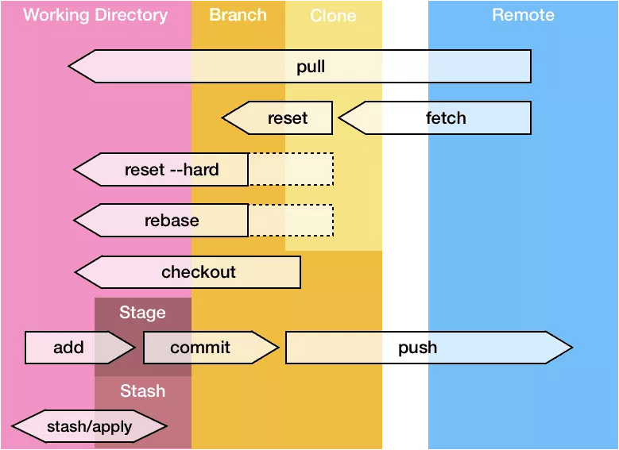
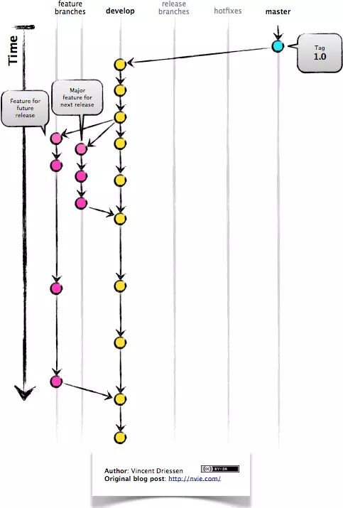
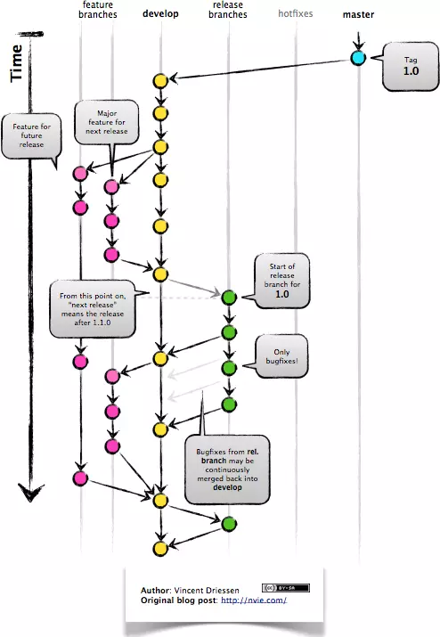
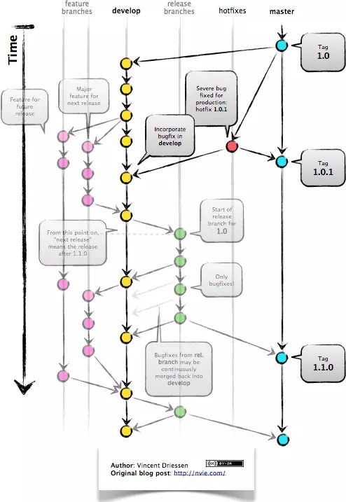
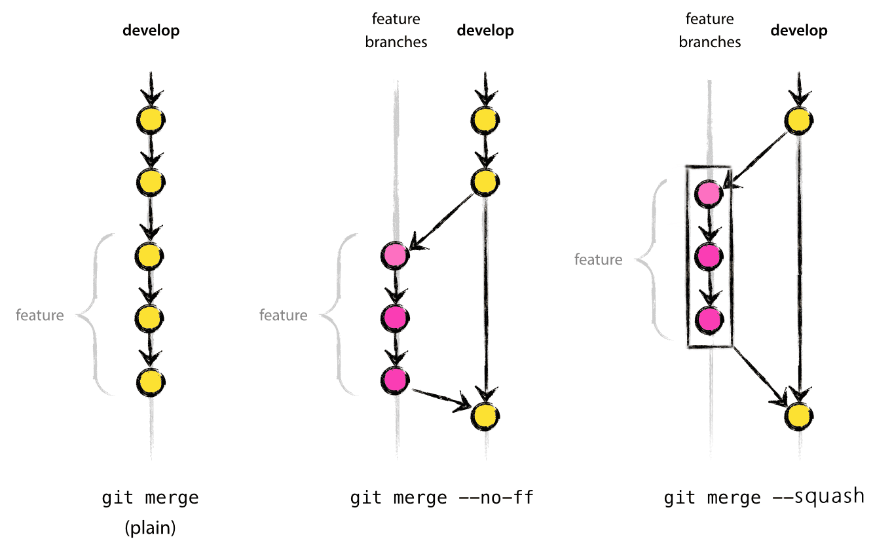

## Vim 操作

使用 Git 就避不开 Vim 的使用，一个最经典的的操作就是：如何保存并退出 Vim 编辑器。这个操作在 [Stack Overflow ](https://stackoverflow.com/questions/11828270/how-do-i-exit-the-vim-editor) 上的浏览量已经超过了 210 万次，可见其重要性。

下面是 Vim 的一些常用操作：

- `:q`（`:quit`）退出

  如果文件内容更改了，则该操作无效，会警告你“有更改未保存”。

- `:q!`（`:quit!`）强制退出（等价于 `ZQ`）

  如果文件内容更改了，该操作会强制生效，不会警告你，更改会丢失。

- `:wq` 保存并退出

  无论文件内容是否更改，都会执行写操作，更新文件的修改日期。

- `:wq!` 强制保存并退出

  如果对文件没有写权限，也要强制写入。

- `:x` 保存并退出（等价于 `:exit` 和 `ZZ`）

  仅当文件内容更改时，才执行写操作，更新文件的修改日期；否则不执行写操作，不会更新文件的修改日期。

- `:qa`（`:quitall`）退出所有 Vim 标签页

  如果内容更改了，则该操作无效，会警告你“有更改未保存”。

刚进入 Vim 编辑器时，是无法直接修改内容的，需要按下 `Insert` 键，才可以进行编辑。

执行 Vim 指令的操作步骤：**按下 `Esc` 键，然后输入 `:` + 操作指令（例如：`:wq`），最后按下 `Enter` 键**。

## Git Bash

Git Bash 是 Git 的命令行工具，但它不等价于 Windows 中自带的 CMD 窗口 `:)`。

Git Bash 有 Linux 的文件系统，内置了一些 Linux 指令，例如：

- `cat` 指令，用于显示文件内容

  - 语法：`cat 文件路径`

  - 使用示例：

    - `cat a.txt`
    - `cat dir1/a.txt`

- `ls` 指令，用于查看当前目录下的所有文件

  默认不显示隐藏文件。常用的参数有：

  - `ls -sh` 显示文件大小
  - `ls -ah` 显示隐藏文件
  - `ls -sh -ah` 显示隐藏文件和文件大小

- `pwd` 指令，显示当前目录的绝对路径
- `touch` 指令，新建一个文件

  - 语法：`touch 文件名1 文件名2 ...`
  - 使用示例：

    - `touch a.txt`
    - `touch a.txt b.txt`

- `mkdir` 指令，新建文件夹

  该指令是 `make directory` 的缩写

  - 语法：`mkdir 文件夹名称1 文件夹名称2 ...`
  - 使用示例：

    - `mkdir dir`
    - `mkdir dir1 dir2`

- `rm` 删除一个文件

  - 语法：`rm 文件名1 文件名2 ...`
  - 使用示例：

    - `rm a.txt`
    - `rm a.txt b.txt`

  默认该指令无法删除文件夹，如果想删除文件夹，需要 `-r` 参数：`rm -r 文件夹名称`

- `mv` 移动文件

  - 语法：`mv 文件移动前的路径 文件移动后的路径`
  - 使用示例：`mv dir1/a.txt dir2/`

  > 必须保证路径中的目录都存在，否则会失败。

- `clear` 清屏

> 注意：以上这些指令，很多在 Windows 的 CMD 中都无法执行。所以谁再说 Git Bash 等价于 CMD，请直接反驳他 `:)`。

## NPM 修改源地址

```bash
# 在 NPM 配置中，修改源地址为淘宝源
$ npm config set registry http://registry.npm.taobao.org/

# 在 NPM 配置中，修改源地址为官方源
$ npm config set registry https://registry.npmjs.org/

# 在 NPM 指令参数中指定源地址
$ npm install xxx --registry=https://registry.npm.taobao.org

# 通过 NRM 工具修改
1、安装 NRM        ：`npm i -g nrm`
2、查看所有的 NPM 源：`nrm ls`
3、切换 NPM 源     ：`nrm use taobao`
```

## Git 基础概念

一张图解 Git：



## Git Flow 基本流程和理解

Git 的标准操作流程，包括如下几个关键的分支：

|分支名|作用|
|:---:|:---|
|master|主分支|
|develop (dev)|主开发分支，包含确定发布的代码|
|feature (feat)|新功能分支，一般一个新功能对应一个分支，对于功能的拆分需要比较合理，以避免一些后面不必要的代码冲突|
|release|发布分支，发布时候用的分支，一般测试时候发现的 bug 在这个分支进行修复|
|hotfix |hotfix 分支，紧急修 bug 的时候用|

Git Flow 的优点：

- 并行开发

  Git Flow 可以很方面的支持并行开发。每个新功能都会建立一个新的 feature 分支，从而将各个功能隔离开来。

- 协作开发

  每个 feature 分支上的改动，都是针对某个新功能。

- 版本发布

  如果要发布版本，把 feature 分支合并到 develop 分支，然后从 develop 分支新建 release 分支来发布新版本。

- 紧急修复

  紧急修复只影响已经发布的 tag，不会影响正在开发的新功能。

Git Flow 具体流程详解：

1、feature 分支都是从 develop 分支创建。开发完后再合并到 develop 分支上，等待发布。如图所示：



2、进行测试，从 develop 分支创建 release 分支。如图所示：



然后，release 这个分支会进行 CI 测试，如果有问题，就在这个分支进行修复。在修复所有问题前，不停地进行流程“发布->测试->修复->重新发布->重新测试”。

3、发布版本，将代码合并到 master 分支。如图所示：


> 其中，master 分支只跟踪已发布版本的代码。合并到 master 上的 commit 只能来自 release 分支和 hotfix 分支。

4、紧急修复，通过 master 分支上的某个 tag 建立 hotfix 分支。如图所示：



> 解决完问题后，将 hotfix 分支合并到 master 分支和 develop 分支上。

以上就是 Git Flow 的基本流程。其关键点在于：

- 对于 feature 流程

  从 develop 分支新建 feature 分支，解决完问题后，通过 PR/MR 合并回 develop 分支。

- 对于 release 流程

  将 feature 合并到 develop，然后从 develop 分支新建 release 分支，release 分支会进行 CI 测试。如果 CI 测试有问题，则直接在 release 分支上修复，然后通过 PR/MR 合并到 develop 分支。如果 CI 测试没问题，将 release 分支合并到 master 分支，发布新版本。

- 对于 hotfix 流程

  hotfix 分支是基于 master 分支上的某个 tag 新建的，修复了问题之后要同时合并到 master 分支和 develop 分支。

## 常用指令

- 配置 log 指令输出样式和别名

  ```bash
  git config --global alias.lg "log --color --graph --pretty=format:'%Cred%h%Creset -%C(yellow)%d%Creset %s %Cgreen(%cr) %C(bold blue)<%an>%Creset' --abbrev-commit"
  ```

- 重命名已被 Git 追踪的文件

  > 用途：**解决修改文件名大小写后，Git 无法检测到的问题**。详见[文章](https://www.jianshu.com/p/28fb73520316)。

  1. 修改 Git 配置（不推荐，Mac 上尝试的没有生效）

     ```bash
     # 让 Git 忽略大小写（项目级生效）
     git config core.ignorecase false

     # 让 Git 忽略大小写（全局生效）
     git config --global core.ignorecase false
     ```

  2. 使用 `git mv` 指令

     ```
     # 1、对于区分大小写的文件系统（如：Windows）
     git mv foldname foldName

     # 2、对于不区分大小写的文件系统（如：Mac）
     # 通过临时文件名作为中介，先将文件重命名为一个完全不相同的名字，再重命名为新的文件名
     git mv foldname tempName && git mv tempName foldName
     ```

- 和远程仓库交互

  - 本地仓库和远程仓库关联

    ```bash
    $ git remote add origin <远程仓库地址>
    ```

  - 查看关联的远程仓库

    ```bash
    $ git remote -v
    ```

  - 更换关联的远程仓库

    ```bash
    # 首先，删除原本关联的远程仓库
    $ git remote rm origin

    # 然后，重新关联
    $ git remote add origin <远程仓库地址>
    ```

  - 拉取远程仓库，并强制覆盖本地仓库

    ```bash
    $ git fetch --all
    $ git reset --hard origin/<分支名>
    ```

    > 该操作会使本地的修改全部丢失，使用远程仓库中的提交历史。

  - 删除远程分支 / 标签

    ```bash
    # 首先，删除本地分支
    $ git branch -d/-D <分支名>
    # 然后，删除远程分支（如果有标签和该分支重名，则方法 1, 2 无效）
    # 方法 1
    $ git push origin :<分支名>
    # 方法 2
    $ git push origin -d <分支名>
    # 方法 3
    $ git push origin :refs/heads/<分支名>

    # 首先，删除本地标签
    $ git tag -d <标签名>
    # 然后，删除远程标签（如果有分支和该标签重名，则方法 1, 2 无效）
    # 方法 1
    $ git push origin :<标签名>
    # 方法 2
    $ git push origin -d <标签名>
    # 方法 3
    $ git push origin :refs/tags/<标签名>
    ```

- 删除对指定文件（夹）的追踪

  - 如果是文件

    ```bash
    # 删除 Git 追踪，保留本地文件
    $ git rm --cached <文件名>

    # 删除 Git 追踪，并删除本地文件
    $ git rm --f <文件名>
    ```

  - 如果是文件夹

    ```bash
    # 删除 Git 追踪，保留本地文件夹
    $ git rm -r --cached <文件夹>

    # 删除 Git 追踪，并删除本地文件夹
    $ git rm -r --f <文件名>
    ```

- 撤销 commit

  ```bash
  $ git reset HEAD~n
  # 或
  $ git reset <commit id>
  ```

  该操作只会撤销 commit，不会撤销代码。如果想撤销 commit 和代码，需要加上 `--hard` 参数：

  ```bash
  $ git reset --hard HEAD~n
  # 或
  $ git reset --hard <commit id>
  ```

- 修改 commit 信息

  - 修改最新的 commit 信息

    ```bash
    $ git commit --amend
    ```

  - 修改之前的 commit 信息

    假设提交了以下几次 commit 信息：

    ```bash
    A — B — C — D — E
    ```

    - 修改某次 commit 信息，并删除后面的 commit 信息

      例如，要修改 C 提交，并且删除 D，E 提交：

      ```bash
      $ git reset --soft C
      ```

      结果如下：

      ```bash
      A — B — C
      ```

    - 修改某次提交，并保留其他的提交

      例如，要将 C 提交放到 A 提交后面，并保留其他的提交：

      ```bash
      # 以 A 提交为基准，新建临时分支 tmp
      $ git checkout -b tmp A

      # 此时，tmp 分支上最新的提交是 A
      # 然后，将 C 提交拿过来
      $ git cherry-pick C

      # 如果想修改 C 提交，执行这个，否则跳过
      $ git commit --amend

      # 最后，把其他的所有提交都拿过来
      $ git cherry-pick B D E
      ```

      结果如下：

      ```bash
      A — C — B — D — E
      ```

- 修改他人贡献的 PR（不是先合并再修改）

  详见：[优雅地修改他人贡献的 Pull Request](https://liuyib.github.io/2020/09/19/add-commits-to-others-pr/)

- 只将修改的文件添加到暂存区，新文件不添加

  ```bash
  $ git add --update/-u
  ```

- 工作区被弄得很乱，想放弃所有修改

  比较建议的方法：

  ```bash
  # 放弃所有文件的修改
  $ git checkout -- .

  # 放弃指定文件的修改
  $ git checkout -- <file>
  ```

  甚至可以用一些奇怪的方法：

  ```bash
  # 先将修改提交到历史记录
  $ git add .
  $ git commit -m "xxx"

  # 然后进行如下操作：
  # 方法 1. 使用 git rebase 删除刚才的提交
  $ git rebase -i HEAD^n
  # 或
  # 方法 2. 使用 git reset 回退
  $ git reset --hard HEAD^n
  ```

- 查看执行过的所有命令

  ```bash
  $ git reflog
  ```

## git add 和 git stage 的区别

两者是同义的。这是由于要跟 SVN 中的 `svn add` 指令进行区别。Git 和 SVN 的 `add` 指令功能完全不同。`svn add` 是将修改加入版本控制（历史记录），`git add` 是将修改提交到暂存区。

由于从 SVN 转到 Git 的用户比较多，为了避免误导，Git 引入了 `git stage`，作用和 `git add` 一样，目的就是为了区别 SVN。

## git reset、git revert 和 git checkout 的区别

**从 commit 层面来说**：

- `git reset` 可以修改 HEAD 指针指向的 commit。

  当下次垃圾回收时，会把当前 commit 之后的 commit 回收掉（在垃圾回收之前，还可以反悔，撤销 `git reset` 操作，将 HEAD 指针指回去。但由于无法确定垃圾回收的时机，因此该操作很危险，可能无法反悔，最好是新建一个临时分支来执行该操作）。

  其参数如下：

  - `--mixed`（默认）：修改暂存区、历史记录
  - `--soft`：修改历史记录
  - `--hard`：修改工作区、暂存区、历史记录

  由于使用 `git reset` 会删除 commit 记录，因此不要在公共的分支（例如 develop 分支）上使用。

- `git revert` 和 `git reset` 的目的一样，但是做法不同。`git revert` 会以创建新 commit 的方式来撤销 commit。这样会保留之前的提交历史，比较安全。
- `git checkout` 可以将 HEAD 指针指向其他分支（如果加上 `-b` 参数，则指向新的分支）。

**从文件层面来说**：

- `git reset` **默认**撤销 commit，并将 commit 中的文件修改回退到工作区（即默认不撤销文件修改）。如果使用 `--hard` 参数，则既撤销 commit，又撤销文件修改（不影响当前工作区的文件变动）。
- `git revert` 将 commit 中的文件修改进行回退（如：新添的文件会被删除，删除的文件会被恢复，也就是相反的操作），然后新增一个 commit 来记录这次回退（不影响当前工作区的文件变动）。
- `git checkout` **默认**用来切换分支，不影响当前工作区的文件变动。如果使用 `--` 参数，则撤销当前工作区的文件变动。

## `git pull` 和 `git pull --rebase` 的区别

假设 Git 提交记录如下：

```
           origin
         ↙
A — B — C
         ↖
           HEAD
```

当本地和远程都做了提交后：

```
            D — E ← origin
         ／
A — B — C
         ＼
            F — G ← HEAD
```

这时，如果要提交代码的话，需要先将远程的提交拉取下来（否则会提交失败）。这就要用到 `git pull` 指令，其执行结果如下：

```
A — B — C — — — — — — — — — H ← HEAD
         ＼               ／
            F — G — D — E ← origin
```

该指令会在拉取远程后，将**远程提交合并到本地提交的后面**（不考虑冲突），但是会多出一个用于合并信息的新提交 H，这样会使得提交历史不再是一条直线。为了避免这样的结果，我们可以使用 `git pull --rebase`，执行结果如下：

```
A — B — C — D — E — — — H — I
                 ↖ origin   ↖ HEAD
```

该指令会在拉取远程后，将**本地提交作为新的 commit 记录（`F — G` 变成了 `H — I`），合并到远程提交的后面**（不考虑冲突），提交历史仍是一条直线。

应用场景：

- 关联本地与远程仓库的 commit 记录

  以 GitHub 为例，新建一个远程仓库，并勾选 `Initialize this repository with a README` 选项，这样会在新建仓库后，生成 README 并提交一条 commit 记录。

  此时，在本地新建一个项目，但是忘记执行 `git pull`（即没有将远程仓库的 README 拉取下来）。然后直接在本地仓库做了一些修改并提交 commit，当 `git push` 时会发现被拒绝了（因为本地和远程的 commit 历史记录不相关）。这时，可能会想到使用 `git pull` 来拉取远程提交，发现又失败了。这是因为两个仓库的 commit 历史记录不相关，导致相互之间都无法同步。

  解决方法是，使用 `git pull --rebase` 指令。如果没有冲突，可以直接合并成功。这时两个仓库的 commit 历史记录就关联起来了。如果有冲突，解决完冲突后，再提交即可。

## 分支操作

- `git branch` 查看本地分支
- `git branch --remote/-r` 查看远程分支
- `git branch <分支名>` 创建分支
- `git checkout <分支名>` 切换分支
- **`git checkout -b <分支名>` 创建并切换分支**
- `git branch -d <分支名>` 删除本地分支（如果分支未合并到主分支上，则该指令失败）
- `git branch -D <分支名>` 强制删除本地分支（即使分支未合并到主分支上，该指令也生效）
- **删除远程分支**

  - `git push origin :<分支名>`（前提：分支名不能与标签重名）
  - `git push origin -d <分支名>`（前提：分支名不能与标签重名）
  - `git push origin :refs/heads/<分支名>`（最稳妥）

- `git merge <分支名>` 合并分支

  常用参数：

  - `git merge --no-ff`
  - `git merge --squash`

  参数作用如图：

  

  假设从 dev 分支分出 feat 分支。

  - 默认（无参数）

    - 如果 dev 分支上没有新的 commit，则直接将 feat 上的 commit 追加到当前分支的末端。（Fast-forward 模式，提交历史仍是直线）
    - 如果 dev 分支上有了新的 commit，则效果同 `--no-ff` 模式。（提交历史不再是直线）

  - `--no-ff` 参数，保留所有 commit 信息，新建一个用于合并的 commit。（提交历史不再是直线）
  - `--squash` 参数，所有 commit 信息会在原来的分支保留，同时会合并到暂存区（stage），用户手动 `git commit` 后，最终合并为一个新的 commit。（提交历史仍是直线）

- `git fetch origin <分支名>` 拉取远程分支（只拉取不合并）
- `git pull origin <分支名>` 拉取远程分支（既拉取又合并，等价于 `git fetch` + `git merge`）

## 标签操作

- `git tag <标签名>` 打标签
- `git tag <标签名> <commit id>` 指定 commit 打标签
- `git tag -a <标签名> -m "注释"` 打标签，并注释
- `git tag -a <标签名> -m <说明文字> <commit id>` 指定 commit 打标签，并注释
- `git tag` 显示所有标签
- `git show <标签名>` 查看标签的详尽信息
- `git tag -d <标签名>` 删除本地标签
- **删除远程标签**

  - `git push origin :<标签名>`（前提：标签名不能与分支重名）
  - `git push origin -d <标签名>`（前提：标签名不能与分支重名）
  - `git push origin :refs/tags/<标签名>`（最稳妥）

- `git push origin <标签名>` 推送某个标签到远程
- `git push origin --tags` 推送所有标签到远程
- `git fetch origin --tags --prune` 将所有远程标签同步到本地

## 储存区操作

- `git stash` 以最新的 commit 信息作为注释，暂存所有修改
- `git stash save "注释"` 指定注释，暂存所有修改
- `git stash list` 显示所有暂存数据
- `git stash clear` 清空所有暂存数据
- `git stash drop` 删除最新的暂存数据
- `git stash drop stash@{n}` 删除指定的暂存数据

  - `git stash drop stash@{0}` 等价于 `git stash drop`

- `git stash pop` 恢复最新的暂存数据，并删除
- `git stash pop stash@{n}` 恢复指定的暂存数据，并删除

  - `git stash pop stash@{0}` 等价于 `git stash pop`

- `git stash apply` 恢复最新的暂存数据，不删除
- `git stash apply stash@{n}` 恢复指定的暂存数据，不删除

  - `git stash apply stash@{0}` 等价于 `git stash apply`

## .gitignore

- 获取 `.gitignore` 文件

  - GitHub 仓库：[github/gitignore](https://github.com/github/gitignore)
  - 在线生成：[gitignore.io
](https://www.toptal.com/developers/gitignore)

- `git add -f <文件名>` 将被忽略的文件，强制添加到暂存区
- `git rm --cached <文件名>` 删除对指定文件的追踪

  如果文件已提交，那么 `.gitignore` 对该文件无效。需要用该指令删除对文件的追踪后，`.gitignore` 文件才能生效。

  - `git rm --cached -r <文件夹名>` 删除对指定文件夹的追踪
  - `git rm --cached -r .` 删除对所有文件（夹）的追踪

## 学习资源

- Git 指令可视化学习网站：[Learn Git Branching # DEMO](https://learngitbranching.js.org/?demo)
- Git 指令可视化练习网址：[Learn Git Branching # NODEMO](https://learngitbranching.js.org/?NODEMO)

---

参考资料：

- [面试中的那些 Git 问题 - 基础部分](https://juejin.im/post/59ecb3976fb9a0452724bde0)
