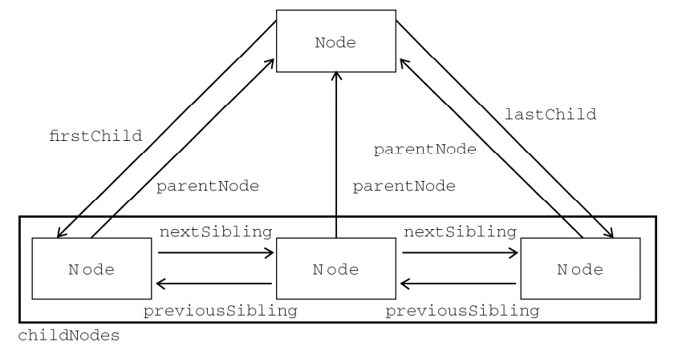

# DOM 部分

> 包括：第十章 DOM、第十一章 DOM 扩展。

## 概念

DOM 是针对 HTML 和 XML 的一套 API。

## 文档元素

文档元素是每个文档的根节点，在 HTML 中，文档元素始终是 `<html>`。在 XML 中，没有预定的元素，因此任何元素都有可能成为文档元素。

## Node 类型

DOM1 中定义了一个 Node 接口，JS 中作为 Node 类型实现了这个接口。JS 中总共有 12 种节点类型，这些节点类型都继承自 Node 类型，并都有一个 `nodeType` 属性。这些节点类型中，常用的是**元素、文本、注释**节点，他们的 `nodeType` 分别是 1（`Node.ELEMENT_NODE`）、3（`Node.TEXT_NODE`）、8（`Node.COMMENT_NODE`）。

- `nodeName` 和 `nodeValue` 属性

  这两个属性的值取决于节点类型，所以使用之前最好检测一下节点类型。例如：

  ``` js
  // 一个 div 元素节点
  if (someNode.nodeType == 1) {
    name = someNode.nodeName;   // DIV（标签名）
    value = someNode.nodeValue; // null
  }

  // 一个文本节点
  if (someNode.nodeType == 3) {
    name = someNode.nodeName;   // #text
    value = someNode.nodeValue; //（文本的具体内容）
  }

  // 一个注释节点
  if (someNode.nodeType == 8) {
    name = someNode.nodeName;   // #comment
    value = someNode.nodeValue; //（注释的具体内容）
  }
  ```

- 访问节点

  - 访问子节点

    - `childNodes` 属性
    - `firstChild` 属性
    - `lastChild` 属性

    `childNodes` 属性中保存着 `NodeList` 对象。`NodeList` 对象是一个类数组对象，它是基于 DOM 结构动态查询的结果，DOM 结构的修改能够自动反映到 `NodeList` 中。其中：

    ``` js
    firstChild == childNodes[0];
    lastChild  == childNodes[childNodes.length - 1];
    ```

    可以通过 `Array.prototype.slice` 方法将类数组对象转换为数组：

    ``` js
    var nodes = Array.prototype.slice.call(someNode.childNodes);
    ```

    如果没有子节点，则 `firstChild`、`lastChild` 均为 `null`。

    > 注意：上面这三个属性，会获取所有类型的节点。由于代码缩进时的空格或换行也是文本节点，所以 `someNode.firstChild`、`someNode.childNodes[0]` 获取到的一般是一个文本节点，并不能得到我们想要的元素节点！

  - 访问父节点

    - `parentNode` 属性

  - 访问兄弟节点

    - `previousSibling` 属性
    - `nextSibling` 属性

    如果一个节点没有上一个 / 下一个节点，那么他的 `previousSibling / nextSibling` 属性为 `null`。

    节点之间的访问属性可以用下图表示：

    

  - 访问根节点

    - `ownerDocument` 属性

    这是所有节点都有的一个属性，表示整个文档节点（是 document 对象，而不是 `<html>`）。

  - 其他

    - `hasChildNodes()` 方法

      判断是否有子节点（12 种节点之一）

## 操作节点

- `appendChild()`

该方法接收一个参数：新增的节点。同时会返回新增的节点。

如果传入的节点已经是文档的一部分，那么该节点会从原来的位置移动到节点末尾。即起到了移动节点的作用。例如：

``` js
// someNode 有多个子节点
var returnNode = someNode.appendChild(someNode.firstChild);
console.log(returnNode == someNode.firstChild); // false
console.log(returnNode == someNode.lastChild);  // true
```

- `insertBefore()`

该方法接收两个参数：新增的节点 和 参照的节点。同时会返回新增的节点。

如果参照节点为 `null`，则作用和 `appendChild` 一样。例如：

```javascript
// 插入成为最后一个节点
var returnNode = someNode.insertBefore(newNode, null);
console.log(returnNode == newNode); // true
console.log(returnNode == someNode.lastChild); // true

// 插入成为第一个节点
var returnNode = someNode.insertBefore(newNode, someNode.firstChild);
console.log(returnNode == someNode.firstChild); // true

// 插入到最后一个节点前面
var returnNode = someNode.insertBefore(newNode, someNode.lastChild);
console.log(returnNode == someNode.childNodes[someNode.childNodes.length - 2]); // true
```

- `replaceChild()`

该方法接收两个参数：新增的节点 和 替换的节点。同时会返回替换的节点。例如：

```javascript
// 替换第一个子节点
someNode.replaceChild(newNode, someNode.firstChild);

// 替换最后一个子节点
someNode.replaceChild(newNode, someNode.lastChild);
```

被替换的节点虽然在文档中没了自己的位置，但是仍然存在。例如：

```html
<div id="oDiv">
  <span>1</span>
  <span>2</span>
  <span>3</span>
  <span>4</span>
</div>
```

```javascript
var oDiv = document.getElementById('oDiv');
var aSpans = oDiv.getElementsByTagName('span');
var oNewNode = document.createElement('span');
oNewNode.innerHTML = 'new node';

var replaceNode = oDiv.replaceChild(oNewNode, aSpans[1]);

console.log(replaceNode); // <span>2</span>
```

- `removeChild()`

该方法接收一个参数：要删除的节点。同时会返回要删除的节点。例如：

```javascript
// 删除第一个节点
someNode.removeChild(someNode.firstChild);

// 删除最后一个节点
someNode.removeChild(someNode.lastChild);
```

上面这四个方法操作的都是**某个节点的子节点**。所以，在使用这几个方法之前，需要先获取父节点。但并不是所有的节点都有子节点。如果在不支持子节点的节点上调用了这个方法，会导致错误。

## 其他方法

- `cloneNode()`

该方法用于复制一个节点，接收一个布尔值参数。参数为 `true`，表示深复制，会复制节点及其整个子节点树；参数为 `false`，表示浅复制，只会复制节点本身。

```html
<ul id="oUl">
  <li>1</li>
  <li>2</li>
  <li>3</li>
  <li>4</li>
</ul>
```

```javascript
var oUl = document.getElementById('oUl');
var deepClone = oUl.cloneNode(true);
var shallowClone = oUl.cloneNode(false);

console.log(deepClone); // <ul id="oUl">
//   <li>1</li>
//   <li>2</li>
//   <li>3</li>
//   <li>4</li>
// </ul>

console.log(shallowClone); // => <ul id="oUl"></ul>
```

- `normalize()`

该方法用于处理文档树中的文本节点。由于解释器的实现或者 `DOM` 操作的原因，可能会出现文本节点中不包含文本，或连续出现两个文本节点。在某个节点上调用这个方法，就会在该节点的后代节点中查找上面两种情况。找到空白节点删除，则删除；找到连续的两个文本节点，则合并为一个文本节点。

## Document 类型

`Document` 表示整个文档。在浏览器中常用的是 `document` 对象，它是 `HTMLDocument` 类型的示例（`HTMLDocument` 继承自 `Document` 类型），同时它也是 `window` 对象的一个属性。

1、文档子节点

文档的子节点可能是：`DocumentType`（最多一个）、`Element`（最多一个）、`ProcessingInstruction` 或 `Comment`。

访问其子节点的快捷方式有：

- `documentElement`
- `childNodes`

```javascript
var html = document.documentElement; // 获取对 <html> 的引用

console.log(html === document.childNodes[0]); // true
console.log(html === document.firstChild); // true
```

类似于 `documentElement` 属性，`document` 对象还有一个 `body` 属性，用于获取对 `<body>` 的引用：

```javascript
var body = document.body; // 获取对 <body> 的引用
```

2、文档信息

- `title` 属性

包含着文档的标题（即 `<title>` 元素中的文本）。

- `URL` 属性

包含着页面的完整 URL。

- `domain` 属性

包含着页面的域名。

- `referrer` 属性

`referrer` 属性中保存着连接到当前页面的那个页面的 `URL`。

上面四个属性中 `title` 和 `domain` 是可写的。

其中 `domain` 并不是可以设置为任何值，有一些限制：

- 不能设置为 `URL` 中不包含的域：

```javascript
// 假设页面来自 p2p.wrox.com

document.domain = wrox.com; // => 成功
document.domain = nczonline.cn; // => 出错
```

- 在根域范围内，域名不能从 “松散” 设置为 “绷紧”：

```javascript
// 假设页面来自 p2p.wrox.com

document.domain = wrox.com; // => 松散（成功）
document.domain = p2p.wrox.com; // => 绷紧（出错！）
```

3、查找元素

- `document.getElementById()`

> IE <= 7 中：
>
> - 不区分 ID 的大小写（例如：myDiv 和 mydiv 被视为相同 ID）
> - 如果有表单元素的 name 和 元素 ID 相同，并且表单元素在前，则该方法会获取到这个表单元素。

- `document.getElementsByClassName()`

- `document.getElementsByTagName()`

- `document.getElementsByName()`

> 前两种方法会获取一个 HTMLCollection 对象，这个对象是一个 **动态的集合**，与 NodeList 很相似。
> 最后一个方法会获取到一个 NodeList 对象，这是一种类数组对象。
>
> 如果获取到的元素集合里的元素上面有 name 属性，则可以用该对象的 **namedItem() 方法** 或 **使用中括号** 取得这个元素：

```html


```

```javascript
var aImgs = document.getElementsByTagName('img');

console.log(aImgs.namedItem('myImg2')); // => 
console.log(aImgs['myImg2']); // => 
```

4、特殊集合

- `document.anchors` - 获取带有 name 属性的 `<a>` 元素
- `document.links` - 获取带有 href 属性的 `<a>` 元素
- `document.forms` - 获取所有 `<form>` 元素
- `document.images` - 获取所有 `` 元素
- `document.scripts` - 获取所有 `<script>` 元素
- `document.applets` - 获取所有 `<applet>` 元素
- `document.embeds` - 获取所有 `<embed>` 元素
- `document.plugins` - 获取所有 `<embed>` 元素

> 这些方法都会返回一个 HTMLCollection 对象。

## ELement 类型

- `nodeType` 为 1
- `nodeName` 为 标签名
- `nodeValue` 为 `null`

> 要访问标签名，可以使用 `nodeName` 或 `tagName` 属性，后者主要是为了清晰起见。两个属性返回的都是标签名的 `全大写` 形式。例如，对 `<div>` 元素 操作，返回：DIV。所以和字符串进行比较操作时，最好转换一下大小写。

1、HTML 元素

所有的 HTML 元素都存在一下标准特性：

- `id`
- `className` - 因为 `class` 是 ECMAScript 中的保留字，所以在 DOM 中要使用 `className` 来访问元素的 `class` 属性。
- `title` - 鼠标经过元素时显示出来的就是 title 属性
- `lang` - 元素内容的语言
- `dir` - 文本的对齐方向（值为：`ltr：left-to-right`，从左至右（左对齐）；`rtl：right-to-left`，从右至左（右对齐））

> 这些属性都是可写的

2、操作属性

- `getAttribute()`

> 有两种属性，通过 `getAttribute` 获取到的值和通过 `对象属性` 获取到的值是不同的：
>
> 1. style - 行间样式
>    通过 `getAttribute` 获取到的是 style 里的 文本。
>    通过 对象属性（elem.style）获取到的是一个对象。
> 2. 事件处理程序（例如：onclick）
>
> **由于这些差别，所以平时只使用对象属性。只有获取自定义属性时，才使用 `getAttribute`**

- `setAttribute()`
- `removeAttribute()`

> 这些方法可以操作自定义属性（根据 H5 标准规定，自定义属性要加 `data-` 前缀）。
> 不过 HTML 中元素的自定义特性，在 DOM 中是不能作为属性访问到的（IE 除外），例如：

```html
<div data-my-attribute="test"></div>
```

```javascript
var oDiv = document.getElementById('oDiv');

console.log(oDiv.getAttribute('data-my-attribute')); // => undefined（IE除外）
```
